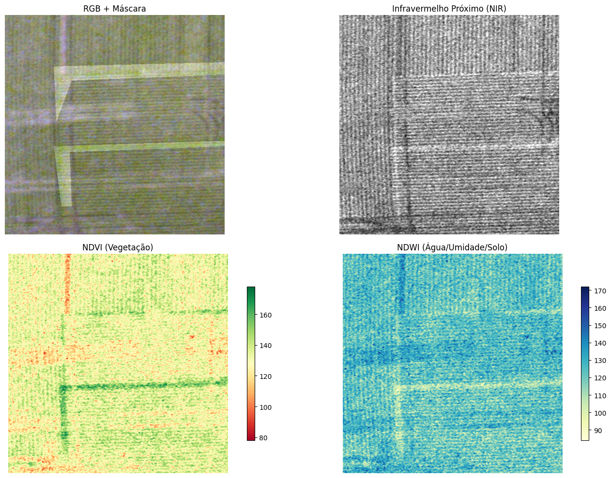
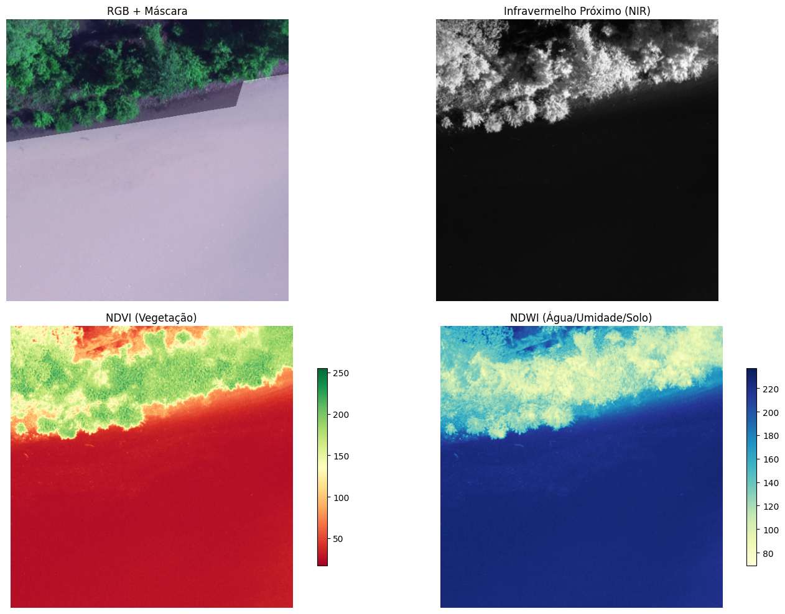

# `<Título em Português do Projeto>`
# `<Project Title in in English>`

## Apresentação

O presente projeto foi originado no contexto das atividades da disciplina de pós-graduação *IA901 - Análise de Imagens e Reconhecimento de Padrões*, 
oferecida no primeiro semestre de 2026, na Unicamp, sob supervisão da Profa. Dra. Leticia Rittner, do Departamento de Engenharia de Computação e Automação (DCA) da Faculdade de Engenharia Elétrica e de Computação (FEEC).

|Nome  | RA | Curso|
|--|--|--|
| Brendon Erick Euzébio Rus Peres  | 256130  | Mestrado em xxxx|
| Luís Fernando Silva Lima  | 298966 | Mestrado em Engenharia Elétrica |
| Mateus Bizzo da Silva  | 200216  | Mestrado em Engenharia de Computação |

## Descrição do Projeto
A segmentação semântica de imagens aéreas agrícolas é uma das principais direções de pesquisa no campo da visão agrícola. Um algoritmo eficaz de segmentar terras agrícolas aéreas é muito importante para a detecção de áreas de anomalias no campo, como a segmentação de áreas secas, fim de linha, deficiência de nutrientes e assim por diante. O reconhecimento do padrão de anomalia é útil para monitorar o estado local das terras agrícolas, avaliar o impacto de desastres naturais. A análise de imagens aéreas agrícolas também apoia a formulação de políticas agrícolas nacionais para aumentar o rendimento dos campos agrícolas e o desenvolvimento econômico regional [1].

O método mais difundido para obter informações sobre a vegetação é através de imagens multiespectrais (MS). Com dados MS, é possível calcular vários índices de vegetação. Normalmente, essas imagens MS são adquiridas de aeronaves ou satélites, mas apenas uma parte das imagens de satélite disponíveis é distribuída gratuitamente [2]. Para compreender como esses índices diferenciam a cobertura vegetal de outros materiais, a Figura 1 apresenta a organização do espectro eletromagnético, destacando as regiões de maior interesse para o sensoriamento remoto, como o visível e o infravermelho.

  
  
  

    <b>Figura 1:</b> Representação visual do espectro eletromagnético.
     
    <i>Fonte: <a href="https://www.linkedin.com/pulse/câmeras-multiespectrais-e-hiperespectrais-embarcadas-em-thiago-silva--iau3f/" target="_blank">Thiago Silva (2026)</a>.</i>
  

Certas bandas, capturadas em frequências específicas ao longo do espectro eletromagnético, têm a capacidade de revelar informações distintas sobre as plantas. Entre essas bandas, a do infravermelho próximo (NIR) possui grande relevância em tarefas agrícolas, pois consegue destacar de forma eficaz a absorção da clorofila e o conteúdo de água na vegetação. Um índice amplamente utilizado que depende da banda NIR é o NDVI (Normalized Difference Vegetation Index), que fornece uma medida quantitativa do vigor e da densidade da vegetação. Em comparação com dados baseados apenas em RGB, a incorporação dessa informação espectral adicional pode potencializar a discriminação de diferentes objetos e feições dentro das imagens. Isso viabiliza uma identificação e classificação mais precisas das culturas, aprimorando o processo de segmentação de imagens [3].

Além disso, o NDWI (Normalized Difference Water Index) tem sido amplamente utilizado em Sensoriamento Remoto (SR) para distinguir corpos d'água de outras superfícies. Este índice baseia-se na observação de que os corpos d'água absorvem a maior parte da banda do NIR, enquanto a vegetação a reflete em sua extensão máxima [4, 5]. Na Tabela 1, é possível observar a correlação de diferentes circunstâncias nas lavouras com os índices abordados.

<b>Tabela 1:</b> Condições de saúde da plantação de acordo com os índices NVDI e NDWI

| Significado da Correlação | NDVI | NDWI |
| :--- | :---: | :---: |
| Vegetação saudável durante a etapa de transpiração (Meio-dia) | + | + |
| Vegetação saudável, mas o solo está seco ou com baixa umidade | + | + |
| Vegetação saudável (Momento de máxima intensidade de verde) | + | - |
| Vegetação saudável em solo arenoso (ou planta em deserto), como abacaxi | + | - |
| Sem vegetação em solo úmido | - | + |
| Vegetação não saudável com algum teor de água de plantas daninhas em solo seco | - | + |
| Sem vegetação em solo frágil/friável | - | - |
| Vegetação não saudável | - | - |

<i>Fonte: Adaptado de Sa et al. [6].</i>

Além disso, Sa et al. [6] propuseram o WeedMap, um framework de mapeamento semântico que utiliza imagens multiespectrais para otimizar a detecção de espécies invasoras na agricultura de precisão e seus resultados mostraram que o NDVI contribui significativamente para uma classificação precisa da vegetação. Nesse contexto, Wijitdechakul [7] apresentaram um espaço multiespectral semântico para a análise de fazendas o qual consistia de imagens com NDVI, NDWI e SAVI (Soil Adjust Vegetation Index) o qual se mostrou capaz de detectar áreas agrícolas saudáveis e não saudáveis por meio da análise de processamento de imagens multiespectrais. A partir dessas premissas, espera-se que a inclusão dessas informações espectrais resulte em uma maior eficiência na segmentação de bordas e anomalias complexas. Ao fornecer um contraste nítido entre diferentes níveis de vigor vegetativo e corpos d'água, os índices reduzem o ruído de iluminação nas imagens aéreas, permitindo que o modelo delimite com precisão as transições de estresse foliar, como zonas de drydown ou deficiência de nutrientes.

A principal motivação deste trabalho é verificar a eficácia de modelos de segmentação semântica com a integração dos canais RGB com os índices NDVI e NDWI, haja vista a sua aplicação no monitoramento de lavouras e na identificação de anomalias em imagens aéreas agrícolas. O sistema proposto deve ser capaz de processar dados multiespectrais para delimitar com precisão regiões de estresse vegetativo e corpos d'água superficiais, correlacionando esses índices com as classes de interesse. O resultado esperado do modelo será a geração de máscaras de segmentação semanticamente consistentes, onde os limites geométricos das anomalias sejam preservados de forma estatisticamente e espacialmente coerente com os dados reais de entrada.

## Metodologia
Portanto, detalhando os métodos utilizados para a construção do espaço semântico podemos segmentar em duas características principais para este trabalho.

#### Extração de Características: NDVI
O primeiro subespaço considerado é o NDVI, gerado a partir da combinação dos canais Vermelho (Red) e NIR (NIR). Este subespaço está relacionado ao índice de vegetação por diferença normalizada, que é um índice de verdejamento ou atividade fotossintética das plantas e um dos índices de vegetação comumente usados [7], o NDVI é definido pela equação (1).

$$
\begin{array}{cc}
NDVI = \dfrac{NIR - RED}{NIR + RED} & \text{(1)}
\end{array}
$$

Onde NIR é o valor do pixel infravermelho próximo e RED é o valor do pixel vermelho.

#### Extração de Características: NDWI
O segundo subespaço necessário é o NDWI o qual é obtido pelos eixos Verde (Green) e NIR. A combinação desses dois canais pode ser utilizada tanto para analisar o teor de água nas folhas das plantas quanto para delimitar corpos d'água na superfície [7], o NDWI pode ser obtido através da equação (2).

$$
\begin{array}{cc}
NDWI = \dfrac{GREEN - NIR}{GREEN + IR} & \text{(2)}
\end{array}
$$

Onde GREEN é o valor do pixel verde e NIR é o valor do pixel infravermelho próximo.

## Bases de Dados e Evolução

Base de Dados | Endereço na Web | Resumo descritivo
----- | ----- | -----
Agriculture-Vision | https://www.agriculture-vision.com/agriculture-vision-2021/dataset-2021 | Dataset voltado para a agricultura de precisão, composto por 94.986 imagens aéreas multiespectrais (RGB e NIR). Ele apresenta nove classes de anomalias as quais podem ser utilizadas para segmentação semântica.

> [Link para o datasheet do dataset](https://docs.google.com/document/d/1QEhjC9ITwu-VQRwQzN5-8O_ES_J7Koa9mj8wCiMX2tE/edit?usp=sharing)

## Ferramentas
As seguintes ferramentas e bibliotecas foram utilizadas para viabilizar o pipeline de processamento de dados, análise estatística, otimização de I/O e visualização de resultados:

### Processamento de Imagens e Visão Computacional
* **Pillow (PIL):** Responsável pela abertura, manipulação e salvamento de imagem do dataset. Utilizado para o carregamento dos arquivos brutos.
* **Matplotlib (Pyplot / Image):** Para leitura e exibição de imagens e máscaras de segmentação.

### Manipulação de Dados e Análise Estatística
* **NumPy:** Manipulação matemática de arrays para o processamento pixel a pixel, normalização de canais e operações algébricas sobre as bandas espectrais (RGB e NIR).
* **Pandas:** Estruturação e manipulação de metadados das imagens.
* **Seaborn:** Construção de visualizações de gráficos.

### Utilidades
* **Concurrent Futures (ThreadPoolExecutor):** Para ler e gravar o volume massivo de imagens do dataset de forma otimizada, reduzindo o gargalo do disco.
* **Tqdm:** Possibilita criar barras de progresso interativas em terminais e loops, dando visibilidade sobre o tempo estimado de execução em processos do pipeline.
* **Pickle:** Serialização e persistência de objetos estruturados em Python, permitindo salvar dicionários de metadados, estruturas de dados intermediárias ou representações compactadas em disco para carregamento rápido.

## Workflow
> Use uma ferramenta que permita desenhar o workflow e salvá-lo como uma imagem (Draw.io, por exemplo). Insira a imagem nesta seção.
> Você pode optar por usar um gerenciador de workflow (Sacred, Pachyderm, etc) e nesse caso use o gerenciador para gerar uma figura para você.
> Lembre-se que o objetivo de desenhar o workflow é ajudar a quem quiser reproduzir seus experimentos.
> Mais informações sobre o workflow podem ser encontradas nos materiais de apoio no Classroom (Reprodutibilidade em pesquisa computacional - workflow).

## Experimentos e Resultados preliminares
### Cálculo dos índices NDVI e NDWI

Esta seção apresenta a visualização e a análise dos resultados obtidos na geração dos índices [NDVI](https://github.com/luisso2/IA901-2026S1/blob/main/projetos/Multiespectral%20Agrícola/data/interim/nvdi) e [NDWI](https://github.com/luisso2/IA901-2026S1/blob/main/projetos/Multiespectral%20Agrícola/data/interim/ndwi), calculados por meio da combinação de bandas espectrais conforme detalhado na metodologia. Os códigos correspondentes a esta etapa de processamento estão disponíveis neste [notebook](https://github.com/luisso2/IA901-2026S1/blob/main/projetos/Multiespectral%20Agrícola/notebooks/NDVI%20and%20NDWI%20generation/nvdi_ndwi.ipynb). Essas novas imagens matriciais foram geradas para cada um dos conjuntos de dados de treinamento, validação e teste. Dentre elas foram escolhidas duas as quais ilustram melhor o comportamento de ambos os índices, a Figura 2 é a primeira delas.

  
  

    <b>Figura 2:</b> Imagem com presença de <i> double plantation </i> em RGB, NIR, NDVI e NDWI.
     
    <i>Fonte: Autoria própria.</i>
  

Na Figura 2, observa-se o fenômeno de <i> double plantation </i>, no qual duas linhas de plantio se cruzam de forma sobreposta. Para esse cenário, é esperado que tais áreas apresentem valores elevados de NDVI, devido à maior densidade de biomassa e à intensa atividade fotossintética local, características que são evidenciadas com maior contraste por esse índice. Adicionalmente, destaca-se a aplicação de <i> color maps </i> nas representações do NDVI e NDWI, para tornar mais fácil a interpretação das variações de vigor e umidade para o público geral. Paralelamente, analisando o NDWI, observa-se que a região de sobreposição das culturas exibe uma resposta distinta das áreas de plantio convencional ao seu redor. Devido a alta presença da folhagem no cruzamento das linhas, ocorre uma maior reflexão da radiação na banda do infravermelho próximo NIR, o que se traduz no mapa de calor o qual mostra a ausência de humidade naquele local enquanto o resto da plantação apresenta relativo NDWI, provavelmente, pela presença de solo úmido. Por fim, na Figura 3 é possível observar outra circunstância a ser analisada.

  
  

    <b>Figura 3:</b> Imagem com presença de plantas e corpos d'água em RGB, NIR, NDVI e NDWI.
     
    <i>Fonte: Autoria própria.</i>
  

A figura acima foi escolhida devido ao fato de apresentar vegetação e áreas com água o que possibilitará observar o comportamento de ambos os índices simultaneamente. Na Figura 3, a porção superior da imagem é composta por uma densa cobertura arbórea, a qual exibe uma forte resposta no NDVI devido à alta refletância no NIR. Inversamente, a grande massa de água que domina a metade inferior absorve quase totalmente a radiação NIR, resultando em valores mínimos de NDVI. No mapa do NDWI, o cenário se inverte onde a região hídrica é destacada com valores máximos no gradiente, mostrando a eficiência do espaço semântico multiespectral em discriminar com precisão alvos com propriedades físicas tão distintas.

> Descreva de forma sucinta e organizada os experimentos realizados.
> Para cada experimento, apresente os principais resultados obtidos.
> Aponte os problemas encontrados nas soluções testadas até aqui.

## Próximos passos
> Liste as próximas etapas planejadas para conclusão do projeto, com uma estimativa de tempo para cada etapa.

## Uso de IA Generativa
### Auxílio na parte gramatical do datasheet
O Gemini foi utilizado no ajuste gramatical e na conversão dos textos para inglês. Prompt utilizado: 
> "Escreva o seguinte trecho em inglês ajustando erros gramaticais quando necessário:"
### Auxílio na criação dos códigos
Foi utilizado o Gemini para a criação dos códigos de navegação entre os diretórios do dataset. Prompt utilizado:
> "Dado os seguintes diretórios escreva um código que permita acessar as imagens presentes nas pastas."

## Referências
[1] SHEN, Yao; WANG, Lei; JIN, Yue. AAFormer: A multi-modal transformer network for aerial agricultural images. In: Proceedings of the IEEE/CVF Conference on Computer Vision and Pattern Recognition. 2022. p. 1705-1711.

[2] M. Barjaktarovic, M. Santoni and L. Bruzzone, "Design and Verification of a Low-Cost Multispectral Camera for Precision Agriculture Application," in IEEE Journal of Selected Topics in Applied Earth Observations and Remote Sensing, vol. 17, pp. 6945-6957, 2024, doi: 10.1109/JSTARS.2024.3377104. 

[3] Yuan, K., Zhuang, X., Schaefer, G., Feng, J., Guan, L., Fang, H.: Deep-learningbased multispectral satellite image segmentation for water body detection. IEEE J. Sel. Topics Appl. Earth Observations Remote Sens. 14, 7422–7434 (2021).

[4] E. Özelkan (2020). Water body detection analysis using NDWI indices derived from Landsat-8 OLI [J]. Polish Journal of Environmental Studies, 29(2):1759-1769.

[5] V. Shashikant, A. Shariff, A. Wayayok, et al (2021). Utilizing TVDI and NDWI to classify severity of agricultural drought in Chuping, Malaysia [J]. Agronomy, 11(6): 1243. 

[6] SA, Inkyu et al. WeedMap: A large-scale semantic weed mapping framework using aerial multispectral imaging and deep neural network for precision farming. Remote Sensing, v. 10, n. 9, p. 1423, 2018.

[7] WIJITDECHAKUL, Jinmika et al. UAV-based multispectral image analysis system with semantic computing for agricultural health conditions monitoring and real-time management. In: 2016 International Electronics Symposium (IES). IEEE, 2016. p. 459-464.

[8] SAHIN, Halil Mertkan et al. Segmentation of weeds and crops using multispectral imaging and CRF-enhanced U-Net. Computers and Electronics in Agriculture, v. 211, p. 107956, 2023.

[9] P. Lottes, M. Hoeferlin, S. Sander, M. Müter, P. Schulze and L. C. Stachniss, "An effective classification system for separating sugar beets and weeds for precision farming applications," 2016 IEEE International Conference on Robotics and Automation (ICRA), Stockholm, Sweden, 2016, pp. 5157-5163, doi: 10.1109/ICRA.2016.7487720.

[10] CHIU, Mang Tik et al. Agriculture-vision: A large aerial image database for agricultural pattern analysis. In: Proceedings of the IEEE/CVF conference on computer vision and pattern recognition. 2020. p. 2828-2838.

[11] INNANI, Shubham et al. Fuse-pn: A novel architecture for anomaly pattern segmentation in aerial agricultural images. In: Proceedings of the IEEE/CVF Conference on Computer Vision and Pattern Recognition. 2021. p. 2960-2968.

[12] Buvanesh, Anirudh & Narang, Pratik & Sinha, Soumendu. (2021). Proposing A Deep Learning Based Architecture for Agriculture Vision. 10.13140/RG.2.2.26628.86404. 

[13] CHIU, Mang Tik et al. The 1st agriculture-vision challenge: Methods and results. In: Proceedings of the IEEE/CVF Conference on Computer Vision and Pattern Recognition Workshops. 2020. p. 48-49.
