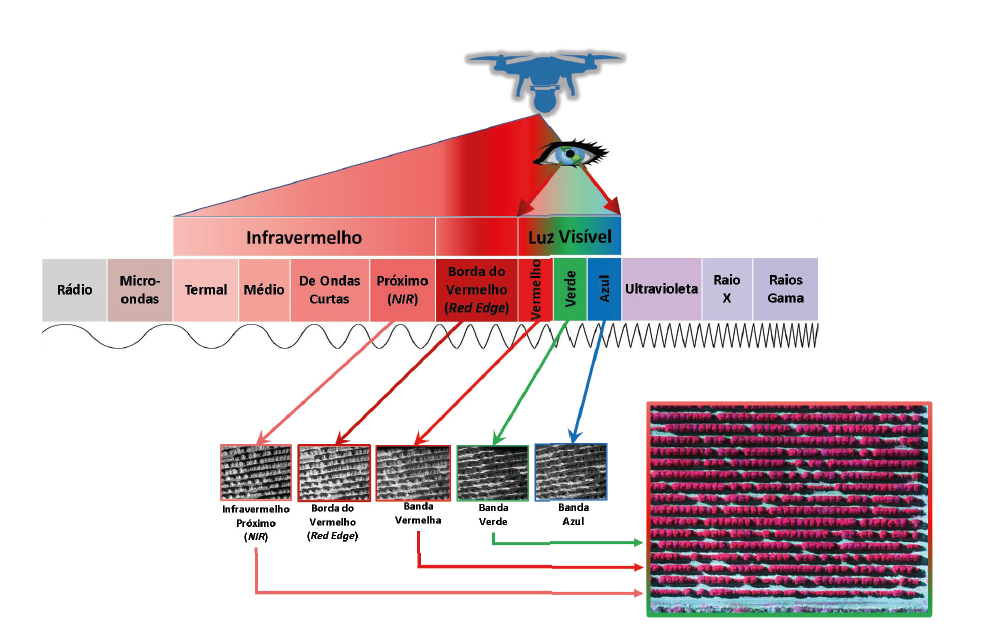
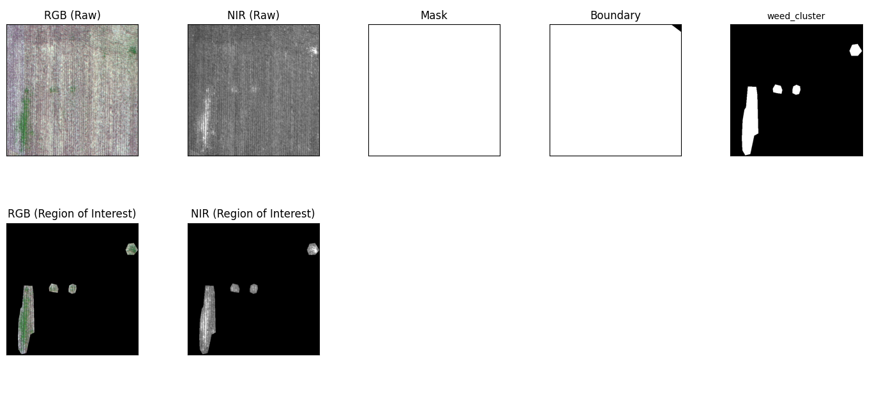
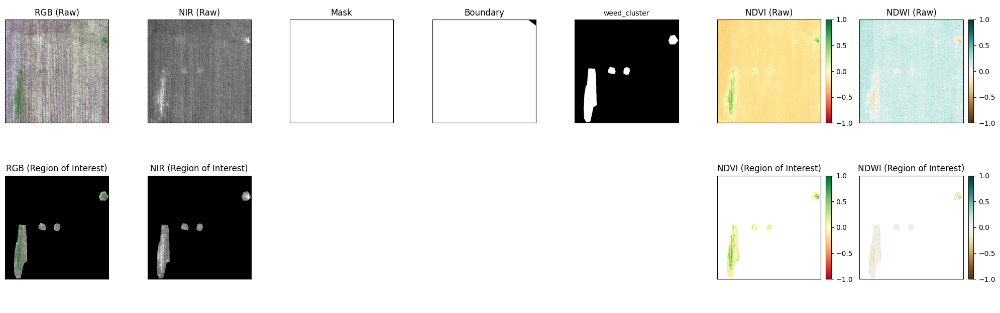
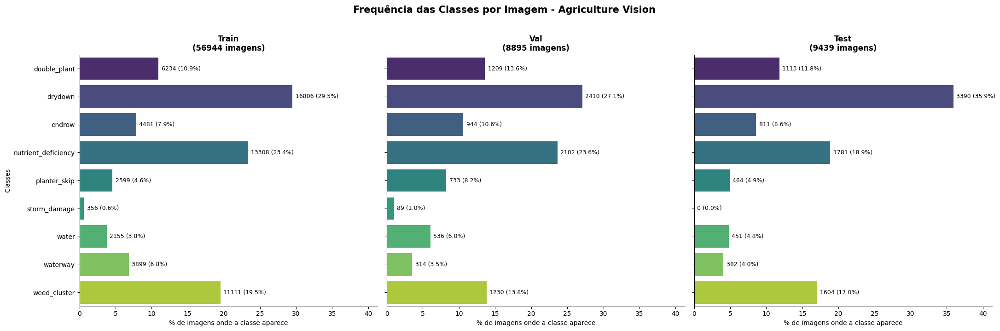
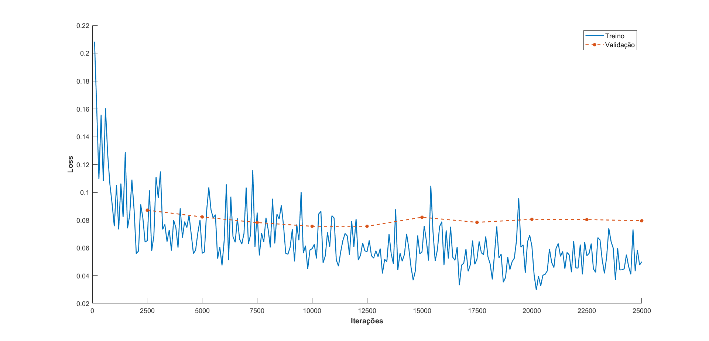
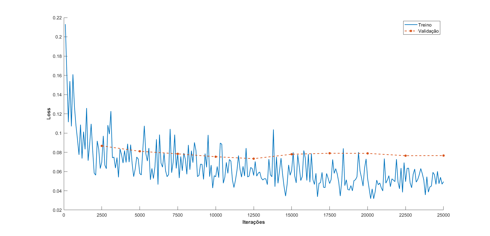
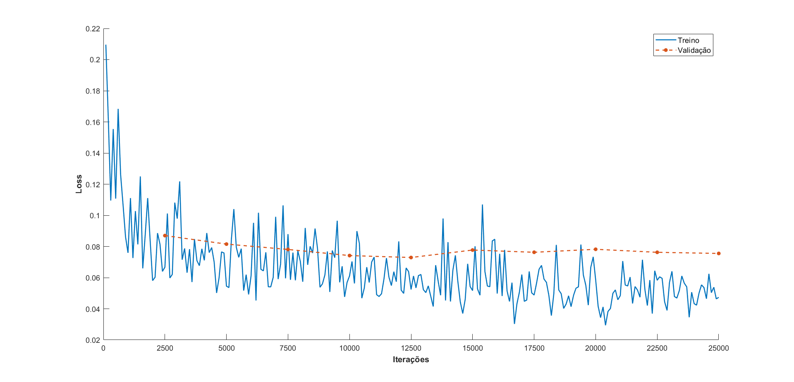

# `Segmentação Semântica de Imagens Agrícolas usando NDVI e NDWI`
# `Semantic Segmentation of Agricultural Images using NDVI and NDWI`

## Apresentação

O presente projeto foi originado no contexto das atividades da disciplina de pós-graduação *IA901 - Análise de Imagens e Reconhecimento de Padrões*, 
oferecida no primeiro semestre de 2026, na Unicamp, sob supervisão da Profa. Dra. Leticia Rittner, do Departamento de Engenharia de Computação e Automação (DCA) da Faculdade de Engenharia Elétrica e de Computação (FEEC).

|Nome  | RA | Curso|
|--|--|--|
| Brendon Erick Euzébio Rus Peres | 256130 | Mestrado em Engenharia Elétrica |
| Luís Fernando Silva Lima | 298966 | Mestrado em Engenharia Elétrica |
| Mateus Bizzo da Silva | 200216 | Mestrado em Engenharia de Computação |

## Descrição do Projeto
A segmentação semântica de imagens aéreas agrícolas é uma das principais direções de pesquisa no campo da visão agrícola. Um algoritmo eficaz de segmentar terras agrícolas aéreas é muito importante para a detecção de áreas de anomalias no campo, como a segmentação de áreas secas, fim de linha, deficiência de nutrientes e assim por diante. O reconhecimento do padrão de anomalia é útil para monitorar o estado local das terras agrícolas, avaliar o impacto de desastres naturais. A análise de imagens aéreas agrícolas também apoia a formulação de políticas agrícolas nacionais para aumentar o rendimento dos campos agrícolas e o desenvolvimento econômico regional [[1]].

O método mais difundido para obter informações sobre a vegetação é através de imagens multiespectrais (MS). Com dados MS, é possível calcular vários índices de vegetação. Normalmente, essas imagens MS são adquiridas de aeronaves ou satélites, mas apenas uma parte das imagens de satélite disponíveis é distribuída gratuitamente [[2]]. Para compreender como esses índices diferenciam a cobertura vegetal de outros materiais, a Figura 1 apresenta a organização do espectro eletromagnético, destacando as regiões de maior interesse para o sensoriamento remoto, como o visível e o infravermelho.

  
  
  

    <b>Figura 1:</b> Representação visual do espectro eletromagnético.
     
    <i>Fonte: <a href="https://www.linkedin.com/pulse/câmeras-multiespectrais-e-hiperespectrais-embarcadas-em-thiago-silva--iau3f/" target="_blank">Thiago Silva (2026)</a>.</i>
  

Certas bandas, capturadas em frequências específicas ao longo do espectro eletromagnético, têm a capacidade de revelar informações distintas sobre as plantas. Entre essas bandas, a do infravermelho próximo (NIR) possui grande relevância em tarefas agrícolas, pois consegue destacar de forma eficaz a absorção da clorofila e o conteúdo de água na vegetação. Um índice amplamente utilizado que depende da banda NIR é o NDVI (*Normalized Difference Vegetation Index*), que fornece uma medida quantitativa do vigor e da densidade da vegetação. Em comparação com dados baseados apenas em RGB, a incorporação dessa informação espectral adicional pode potencializar a discriminação de diferentes objetos e feições dentro das imagens. Isso viabiliza uma identificação e classificação mais precisas das culturas, aprimorando o processo de segmentação de imagens [[3]].

Além disso, o NDWI (*Normalized Difference Water Index*) tem sido amplamente utilizado em Sensoriamento Remoto (SR) para distinguir corpos d'água de outras superfícies. Este índice baseia-se na observação de que os corpos d'água absorvem a maior parte da banda do NIR, enquanto a vegetação a reflete em sua extensão máxima [[4],[5]]. Na Tabela 1, é possível observar a correlação de diferentes circunstâncias nas lavouras com os índices abordados.

<b>Tabela 1:</b> Condições de saúde da plantação de acordo com os índices NVDI e NDWI

| Significado da Correlação | NDVI | NDWI |
| :--- | :---: | :---: |
| Vegetação saudável durante a etapa de transpiração (Meio-dia) | + | + |
| Vegetação saudável, mas o solo está seco ou com baixa umidade | + | + |
| Vegetação saudável (Momento de máxima intensidade de verde) | + | - |
| Vegetação saudável em solo arenoso (ou planta em deserto), como abacaxi | + | - |
| Sem vegetação em solo úmido | - | + |
| Vegetação não saudável com algum teor de água de plantas daninhas em solo seco | - | + |
| Sem vegetação em solo frágil/friável | - | - |
| Vegetação não saudável | - | - |

<i>Fonte: Adaptado de Sa et al. [[6]].</i>

Além disso, Sa et al. [[6]] propuseram o *WeedMap*, um *framework* de mapeamento semântico que utiliza imagens multiespectrais para otimizar a detecção de espécies invasoras na agricultura de precisão e seus resultados mostraram que o NDVI contribui significativamente para uma classificação precisa da vegetação. Nesse contexto, Wijitdechakul [[7]] apresentaram um espaço multiespectral semântico para a análise de fazendas o qual consistia de imagens com NDVI, NDWI e SAVI (*Soil Adjust Vegetation Index*) o qual se mostrou capaz de detectar áreas agrícolas saudáveis e não saudáveis por meio da análise de processamento de imagens multiespectrais. A partir dessas premissas, espera-se que a inclusão dessas informações espectrais resulte em uma maior eficiência na segmentação de bordas e anomalias complexas. Ao fornecer um contraste nítido entre diferentes níveis de vigor vegetativo e corpos d'água, os índices reduzem o ruído de iluminação nas imagens aéreas, permitindo que o modelo delimite com precisão as transições de estresse foliar, como zonas de drydown ou deficiência de nutrientes.

A principal motivação deste trabalho é verificar a eficácia de modelos de segmentação semântica com a integração dos canais RGB com os índices NDVI e NDWI, haja vista a sua aplicação no monitoramento de lavouras e na identificação de anomalias em imagens aéreas agrícolas. O sistema proposto deve ser capaz de processar dados multiespectrais para delimitar com precisão regiões de estresse vegetativo e corpos d'água superficiais, correlacionando esses índices com as classes de interesse. O resultado esperado do modelo será a geração de máscaras de segmentação semanticamente consistentes, onde os limites geométricos das anomalias sejam preservados de forma estatisticamente e espacialmente coerente com os dados reais de entrada.

## Metodologia
### Cálculo dos índices climáticos
No nosso trabalho investigamos a influência do NDVI e NDWI para segmentação das imagens, o NDVI é um índice de verdejamento ou atividade fotossintética das plantas e um dos índices de vegetação comumente usados [[7]], o NDVI é definido pela equação (1).

$$
\begin{array}{cc}
NDVI = \dfrac{NIR - RED}{NIR + RED} & \text{(1)}
\end{array}
$$

Onde NIR é o valor do pixel infravermelho próximo e RED é o valor do pixel vermelho. É importante ressaltar que o NDVI apresenta valor no intervalo [-1, 1] onde valores maiores que 0 indicam a presença de plantas e valores menores que 0 indicam a ausência. Nesse contexto, para armazenar o NDVI em formato de imagem foi necessário fazer a conversão do intervalo [-1, 1] para [0, 255] e para manter o mesmo tipo de arquivo que as imagens em NIR foi escolhido o formato <i>.jpg</i>.

Ademais, o NDWI pode ser utilizado tanto para analisar o teor de água nas folhas das plantas quanto para delimitar corpos d'água na superfície [[7]], o NDWI pode ser obtido através da equação (2).

$$
\begin{array}{cc}
NDWI = \dfrac{GREEN - NIR}{GREEN + NIR} & \text{(2)}
\end{array}
$$

Onde GREEN é o valor do pixel verde e NIR é o valor do pixel infravermelho próximo. Da mesma forma o índice anterior, o NDWI também é mapeado no intervalo [-1, 1] os quais valores maiores que 0 indicam presença de água, enquanto valores menores que 0 geralmente representam solo ou vegetação. Portanto, houve a mudança de intervalo para [0, 255] e armazenados no formato <i>.jpg</i>.

### Modelo utilizado
O modelo utilizado neste trabalho é considerado o *baseline* para o Agriculture-Vision e baseia-se em uma arquitetura FPN (*Feature Pyramid Network*). O *encoder* da FPN é uma rede ResNet-50, da qual são mantidos os três primeiros blocos residuais, enquanto o último bloco (layer4) é modificado para um bloco residual dilatado com taxa igual a 4.

No *decoder* da FPN, as conexões laterais são implementadas utilizando duas camadas de convolução 3 × 3 e uma camada 1 × 1. Cada uma das convoluções 3 × 3 é sucedida por uma camada de *bacth normalization* e uma função de ativação *Leaky ReLU* com inclinação negativa de 0,01, enquanto a última camada de convolução 1 × 1 não possui unidades de *bias*. Para os módulos de *upsampling*, é utilizada uma camada de deconvolução com *kernel* = 3, *stride* = 2 e *padding* = 1, seguida por uma camada de *bacth normalization*, ativação *Leaky ReLU* e outra convolução 1 × 1 sem *bias*.

A saída de cada conexão lateral e do respectivo módulo de *upsampling* são somadas, e o resultado é processado por mais duas camadas de convolução 3 × 3 com *bacth normalization* e *Leaky ReLU*. Por fim, as saídas de todos os níveis da pirâmide são redimensionadas para a maior resolução da pirâmide via interpolação bilinear e, em seguida, concatenadas. Esse resultado final é passado por uma camada de convolução 1 × 1 com unidades de *bias* para predizer o mapa semântico definitivo.

**ACRESCENTAR A ADAPTAÇÃO DA INTERPOLAÇÃO DA SAÍDA DO MODELO**

### Métodos de avaliação
A avaliação dos resultados foi realizada de forma quantitativa e qualitativa. A forma quantitativa foi através do mIoU (sigla) e a qualitativa através da visualização das segmentações.

A avaliação do desempenho do modelo foi feita de forma quantitativa e qualitativa. A análise quantitativa baseou-se na métrica *Mean Intersection over Union* ($mIoU$) descrita na equação (3), comumente utilizada para mensurar a acurácia de sobreposição por classe. Além disso, a avaliação qualitativa foi realizada por meio da inspeção visual e comparativa das máscaras de segmentação geradas pelo modelo face ao *ground-truth* das imagens agrícolas. O $mIoU$ calcula a média da razão entre a área de interseção e a área de união entre as predições do modelo e as anotações reais, estendida a todas as 8 classes e o *background*.

$$
\begin{array}{cc}
mIoU = \frac{1}{k} \sum_{i=1}^{k} \frac{TP_i}{TP_i + FP_i + FN_i} & \text{(3)}
\end{array}
$$

Onde:
* **$k$**: Número total de classes.
* **$TP_i$** (*True Positives*): Verdadeiros Positivos da classe $i$.
* **$FP_i$** (*False Positives*): Falsos Positivos da classe $i$.
* **$FN_i$** (*False Negatives*): Falsos Negativos da classe $i$.

> Abordagem adotada pelo projeto na busca pela resposta às perguntas de pesquisa. Justificar teoricamente, sempre que possível, a metodologia adotada.

## Bases de Dados
O dataset utilizado é o Agriculture-Vision 2022, disponível em: [Agriculture-Vision Challenge 2022](https://www.agriculture-vision.com/agriculture-vision-2022/prize-challenge-2022/agriculture-vision-challenge-2022).

A base é composta por 75.278 imagens aéreas coletadas por drones cobrindo diversos hectares de lavouras nos Estados Unidos ao longo de diversas safras entre 2017 e 2019. Cada amostra do *dataset* consiste de imagens matriciais multiespectrais que contêm 4 canais: RGB e NIR, além disso, cada imagem possui um *boundary map* e uma máscara, onde o *boundary map* indica a região de plantação e a máscara sinaliza os pixels válidos, portanto, regiões que não estão contidas no *boundary map* ou da máscara não são utilizadas.

O *dataset* contém 9 tipos de anotações as quais são armazenadas separadamente através de máscaras binárias permitindo sobreposição: 
* *Double plant*: quando duas linhas de plantio se cruzam de forma sobreposta, gerando um superadensamento local de plantas;
* *Drydown*: fase em que a planta perde umidade e começa a secar gradualmente antes da colheita;
* *Endrow*: extremidades da plantação onde as máquinas agrícolas realizam curvas de manobra;
* *Nutrient deficiency*: áreas onde a cultura sofre por falta de compostos essenciais resultando em amarelamento das folhas;
* *Planter skip*: falhas mecânicas na semeadora, deixando áreas vazias sem nenhuma semente ou planta;
* *Storm damage*: áreas afetadas por eventos climáticos severos;
* *Water*: acúmulos explícitos de água dentro ou nas margens da plantação, como poças de inundação ou lagos de irrigação;
* *Waterway*: caminhos para o fluxo e escoamento do excesso de água de chuva no campo;
* *Weed cluster*: manchas de vegetação invasora que disputam nutrientes com a cultura principal.

Dentre essas 9 classes os criadores da base de dados sugerem não utilizar *storm damage* devido a baixa quantidade de imagens o que seria problemático para o treinamento do modelo. Na Figura 2 é possível observar uma amostra da classe *weed cluster* e sua respectiva ROI (*Region of Interest*).

  
  
  

    <b>Figura 2:</b> Exemplo de amostra da classe <i>weed cluster</i>.
     
  

Na Figura 3 é apresentada a mesma amostra anterior, porém com os índices NDVI e NDWI.

  
  
  

    <b>Figura 3:</b> Exemplo anterior da classe <i>weed cluster</i> com NDVI e NDWI.
     
  

Além disso, a base de dados possui sugestão de divisão entre treinamento/validação/teste, no entanto, como este *dataset* é utilizado em um *challenge* anual as imagens de teste não possui anotações, então, a adaptação adotada foi derivar o *split* de teste a partir do *split* de validação oficial, seguindo a mesma lógica descrita no *paper* original — splitar por fazenda, não por imagem individual. Assim, o *split* de validação oficial foi dividido em *val* (50% das fazendas) e teste (50% das fazendas), essa divisão por *farmland* evita o *data leakeage*. A distribuição das classes no *split* utilizado é observada na Figura 4.

  
  
  

    <b>Figura 4:</b> Distribuição das classes no <i>split</i> utilizado.
     
  

Observando a Figura 4 é notório o grande desbalanceamento de classes, um dos principais desafios do Agriculture Vision. Enquanto classes como *drydown* e *nutrient_deficiency* apresentam uma frequência expressiva outras categorias sofrem com escassez de dados. Essa diferença na distribuição amostral impõe uma grande dificuldade para que os modelos aprendam os padrões mais raros de forma equilibrada.

[Link para o datasheet do dataset](https://github.com/luisso2/IA901-2026S1/blob/main/projetos/Multiespectral%20Agrícola/data/Datasheet___Agriculture_Vision.pdf)

> Elencar as bases de dados utilizadas no projeto.

> Faça uma descrição sobre o que o grupo concluiu sobre esta base. Sugere-se que respondam perguntas ou forneçam informações indicadas a seguir:
> * Qual o formato dessa base, tamanho, tipo de anotação?
> * Quais as transformações e tratamentos feitos? Limpeza, reanotação, etc.
> * Utilize tabelas e/ou gráficos que descrevam os aspectos principais da base que são relevantes para o projeto.

> Forneça também o link para o "datasheet" criado para os datasets (anexado na pasta `data`, como indicado nas [instruções E2](https://github.com/Disciplinas-FEEC/IA901-2026S1/blob/main/templates/ia901-E2-instructions.md)), contendo informações mais detalhadas e sistematizadas sobre as bases de dados.

## Ferramentas
> Panorama das ferramentas utilizadas incluindo uma breve discussão sobre o uso das mesmas.

## Workflow
> Use uma ferramenta que permita desenhar o workflow e salvá-lo como uma imagem (Draw.io, por exemplo). Insira a imagem nesta seção.
> Você pode optar por usar um gerenciador de workflow (Sacred, Pachyderm, etc) e nesse caso use o gerenciador para gerar uma figura para você.
> Lembre-se: o objetivo de desenhar o workflow é ajudar a quem quiser reproduzir seus experimentos!!!

## Experimentos e Resultados
Neste trabalho abordamos quatro estratégias para avaliar o impacto dos diversos canais de entradas e do desbalanceamento de classes, para cada abordagem os modelos foram treinados em 25.000 iterações e foi utilizado um *batch* de 40 amostras divididos em duas *GTX Titan Xp* (12 GB), onde os pesos em cada GPU são atualizados a cada 2 *batchs* lidos, sendo que o valor de $Iou$ dos dados de validação era coletado a cada 2.500 iterações. Foi utilizado o algoritmo SGD com uma taxa de aprendizado base de 0,01 e *weight decay* de $5 \times 10^{-4}$, porém, ao longo das 25.000 iterações, o treinamento inicia com uma etapa de *warmup* de 1.000 iterações, onde a taxa de aprendizado cresce de forma linear entre 0 e 0.01. Na sequência, mantém-se o treinamento por 7.000 iterações sob uma taxa constante de 0,01. Nas últimas 17.000 iterações, a taxa de aprendizado diminui progressivamente até atingir 0, utilizando a regra polinomial.

### RGB (*Red, Green, Blue*)
A primeira estratégia foi utilizar como entrada do modelo apenas os canais RGB, pois, é possível é estabelecer um referencial de desempenho baseado unicamente no espectro visível. O objetivo deste experimento é mensurar o quanto a ausência de faixas espectrais infravermelhas prejudica a geração das segmentações e o quanto o modelo se torna vulnerável a ruídos de sombreamento e variações de iluminação natural nas imagens aéreas. A curva de aprendizado pode ser observada na Figura 5.

  
  
  

    <b>Figura 5:</b> Comportamento da função <i>loss</i> durante o treinamento e validação utilizando RBG.
     
  

### RGB com Weight Loss (*Red, Green, Blue* + *Weight Loss*)

### RGBN (*Red, Green, Blue, NIR*)
Nessa abordagem expandiu-se o espaço de entrada para englobar a informações NIR, configurando o arranjo como RGBN. Diferente da abordagem convencional que se limita ao espectro visível, a inclusão desse quarto canal fornece ao modelo dados diretamente correlacionados com as propriedades biofísicas das áreas agrícolas, tais como o vigor da vegetação e o estresse hídrico. Essa configuração serve como um importante ponto de controle experimental para determinar se o modelo consegue gerar melhores segmentações a partir de outro canal com informações mais detalhadas. Na Figura 6 é ilustrado o comportamento da *loss* de treino e validação durante o treinamento.

  
  
  

    <b>Figura 6:</b> Comportamento da função <i>loss</i> durante o treinamento e validação utilizando RGBN.
     
  

### RGBNVW (*Red, Green, Blue, NIR, NDVI, NDWI*)
A última estratégia introduz a fusão completa de recursos ao concatenar os canais RGB e NIR aos subespaços espectrais calculados, resultando no arranjo RGBNVW. Nessa configuração, o tensor de entrada do modelo é expandido para a dimensão $512 \times 512 \times 6$. A hipótese fundamental dessa abordagem é que, ao fornecer explicitamente os mapas de calor do NDVI (vigor vegetativo) e do NDWI (dinâmica hídrica/solo) junto às bandas brutas, a rede de segmentação semântica seja guiada por indutores de características altamente discriminantes. A curva de *loss* pode ser observada na Figura 7.

  
  
  

    <b>Figura 7:</b> Comportamento da função <i>loss</i> durante o treinamento e validação utilizando RGBNVW.
     
  

### Resultados

Com o fim do treinamento os valores de $IoU$ para os dados de validação foram validados e estão presentes na Tabela 2. Ao analisar os resultados numéricos obtidos nos experimentos demonstram que a progressiva expansão do tensor de entrada e a aplicação de funções de perda ponderadas alteraram significativamente a capacidade de convergência e a acurácia de sobreposição por classe nas redes de segmentação semântica.

| | mIoU (%) | Background | Double plant | Drydown | Endrow | Nutrient deficiency | Planter skip | Water | Waterway | Weed cluster |
| :--- | :---: | :---: | :---: | :---: | :---: | :---: | :---: | :---: | :---: | :---: |
| RGB | 0,3693 | 0,7189 | 0,2289 | 0,5057 | 0,0942 | 0,2803 | **0,3006** | 0,7028 | 0,2288 | 0,263 |
| RGB + Weighted Loss | 0,3706 | 0,7196 | 0,2211 | 0,5081 | 0,0962 | 0,2783 | 0,2861 | 0,713 | 0,237 | **0,2763** |
| RGBN | 0,3756 | 0,7291 | 0,2024 | 0,4996 | **0,1133** | 0,3554 | 0,276 | 0,7068 | 0,2564 | 0,2418 |
| RGBNVW | **0,3836** | **0,7326** | **0,2308** | **0,5215** | 0,1033 | **0,3512** | 0,2709 | **0,7194** | **0,2757** | 0,247 |

A análise quantitativa dos experimentos revela que a progressiva adição de informação espectral impactou diretamente a capacidade de generalização do modelo. O arranjo RGBNVW (RGB + NIR + NDVI + NDWI) atingiu o melhor desempenho global do projeto, estabelecendo o pico de $mIoU$ em 38,36%. A inclusão explícita dos subespaços baseados em índices forneceu ao modelo um forte indutor de características, o que permitiu obter os melhores resultados nas classes estruturais complexas do dataset *Agriculture-Vision*, como *double plant* (23,08%) e *drydown* (52,15%), superando o uso da informação espectral bruta isolada. Além disso, a inserção do NDWI na entrada impulsionou significativamente a detecção de dinâmicas hídricas, alcançando os maiores índices de acerto nas classes *water* (71,94%) e *waterway* (27,57%).

Por outro lado, a transição do espectro visível (RGB) para o espectro multiespectral bruto (RGBN) gerou um ganho imediato, elevando o $mIoU$ global de 36,93% para 37,56%. O canal NIR bruto isolado provou-se eficiente em delimitar áreas de transição mecânica e falhas de borda no campo, fazendo com que a classe *endrow* atingisse o seu ápice de desempenho com 11,33%. A resposta física da clorofila na banda do infravermelho próximo também reduziu de forma expressiva as ambiguidades visuais na identificação de distúrbios metabólicos na lavoura, fazendo a métrica da classe *nutrient deficiency* dar um salto de 28,03% para 35,54% de $mIoU$.

Em paralelo, a aplicação da estratégia RGB + Weighted Loss introduziu uma dinâmica importante para tentar mitigar o desbalanceamento de classes do dataset. Ao alterar a penalização dos erros na função de custo, a abordagem conseguiu um ganho focado na classe *weed cluster* que, apesar de ser a terceira mais frequente do *dataset*, alcançou o seu melhor resultado histórico com 27,63% de $mIoU$. Contudo, essa estratégia mostrou-se pouco suficiente para resolver o problema de maneira ampla, uma vez que o ganho no $mIoU$ global foi pouco e gerou um relativo *trade-off* ao degradar o desempenho em anomalias menos frequentes e de geometria linear perfeita, como *planter skip*, que decaiu de 30,06% para 28,61%. Esse comportamento evidencia que apenas ajustar os pesos na função de perda não basta para compensar as complexidades do dataset sem prejudicar o aprendizado de feições geométricas específicas e menos representadas.

Portanto, os limites encontrados neste *pipeline* indicam que são necessários trabalhos mais profundos para superar o teto de desempenho imposto pelo desbalanceamento crítico e pela complexidade geométrica do dataset *Agriculture-Vision*, além disso, é necessário fazer um maior refino nos canais utilizados, testando várias possibilidades, algo que costuma trazer melhores resultados em outras pesquisas da área.

## Conclusão
> Destacar as principais conclusões obtidas no desenvolvimento do projeto.
> Destacar os principais desafios enfrentados.
> Principais lições aprendidas.

## Trabalhos Futuros
> O que poderia ser melhorado se houvesse mais tempo?

## Uso de IA Generativa
> Adicione aqui em quais tarefas foi usada alguma ferramenta de IA Generativa. Para cada tarefa indicada detalhe qual a ferramenta e qual o prompt utilizado.

## Referências
[[1]] SHEN, Yao; WANG, Lei; JIN, Yue. AAFormer: A multi-modal transformer network for aerial agricultural images. In: Proceedings of the IEEE/CVF Conference on Computer Vision and Pattern Recognition. 2022. p. 1705-1711.

[1]: https://openaccess.thecvf.com/content/CVPR2022W/AgriVision/html/Shen_AAFormer_A_Multi-Modal_Transformer_Network_for_Aerial_Agricultural_Images_CVPRW_2022_paper.html

[[2]] M. Barjaktarovic, M. Santoni and L. Bruzzone, "Design and Verification of a Low-Cost Multispectral Camera for Precision Agriculture Application," in IEEE Journal of Selected Topics in Applied Earth Observations and Remote Sensing, vol. 17, pp. 6945-6957, 2024, doi: 10.1109/JSTARS.2024.3377104. 

[2]: https://ieeexplore.ieee.org/abstract/document/10472047

[[3]] Yuan, K., Zhuang, X., Schaefer, G., Feng, J., Guan, L., Fang, H.: Deep-learningbased multispectral satellite image segmentation for water body detection. IEEE J. Sel. Topics Appl. Earth Observations Remote Sens. 14, 7422–7434 (2021).

[3]: https://ieeexplore.ieee.org/abstract/document/9492784

[[4]] E. Özelkan (2020). Water body detection analysis using NDWI indices derived from Landsat-8 OLI [J]. Polish Journal of Environmental Studies, 29(2):1759-1769.

[4]: https://www.pjoes.com/pdf-110447-47217?filename=47217.pdf

[[5]] V. Shashikant, A. Shariff, A. Wayayok, et al (2021). Utilizing TVDI and NDWI to classify severity of agricultural drought in Chuping, Malaysia [J]. Agronomy, 11(6): 1243. 

[5]: https://www.mdpi.com/2073-4395/11/6/1243

[[6]] SA, Inkyu et al. WeedMap: A large-scale semantic weed mapping framework using aerial multispectral imaging and deep neural network for precision farming. Remote Sensing, v. 10, n. 9, p. 1423, 2018.

[6]: https://www.mdpi.com/2072-4292/10/9/1423

[[7]] WIJITDECHAKUL, Jinmika et al. UAV-based multispectral image analysis system with semantic computing for agricultural health conditions monitoring and real-time management. In: 2016 International Electronics Symposium (IES). IEEE, 2016. p. 459-464.

[7]: https://ieeexplore.ieee.org/abstract/document/7861050?casa_token=ZVBJWtArFtMAAAAA:mj2V13NujgR3PuCt4vT9YSiXDYv3cyrE4v8F5_BEk20n6jfQgs8mSwvMbBdLZG-iYjO1ht0ZVrM

[[8]] SAHIN, Halil Mertkan et al. Segmentation of weeds and crops using multispectral imaging and CRF-enhanced U-Net. Computers and Electronics in Agriculture, v. 211, p. 107956, 2023.

[8]: https://www.sciencedirect.com/science/article/pii/S0168169923003447

[[9]] P. Lottes, M. Hoeferlin, S. Sander, M. Müter, P. Schulze and L. C. Stachniss, "An effective classification system for separating sugar beets and weeds for precision farming applications," 2016 IEEE International Conference on Robotics and Automation (ICRA), Stockholm, Sweden, 2016, pp. 5157-5163, doi: 10.1109/ICRA.2016.7487720.

[9]: https://ieeexplore.ieee.org/abstract/document/7487720?casa_token=WAEDZqDP2b4AAAAA:gIlJa8XbV39uWIsxHV9_fUjS4kAd8skRZOO3a1qsMCLfrN7eFAASlnF6e_YIG9NfqpUhtXnLW5I

[[10]] CHIU, Mang Tik et al. Agriculture-vision: A large aerial image database for agricultural pattern analysis. In: Proceedings of the IEEE/CVF conference on computer vision and pattern recognition. 2020. p. 2828-2838.

[10]: https://openaccess.thecvf.com/content_CVPR_2020/html/Chiu_Agriculture-Vision_A_Large_Aerial_Image_Database_for_Agricultural_Pattern_Analysis_CVPR_2020_paper.html

[[11]] INNANI, Shubham et al. Fuse-pn: A novel architecture for anomaly pattern segmentation in aerial agricultural images. In: Proceedings of the IEEE/CVF Conference on Computer Vision and Pattern Recognition. 2021. p. 2960-2968.

[11]: https://openaccess.thecvf.com/content/CVPR2021W/AgriVision/html/Innani_Fuse-PN_A_Novel_Architecture_for_Anomaly_Pattern_Segmentation_in_Aerial_CVPRW_2021_paper.html

[[12]] Buvanesh, Anirudh & Narang, Pratik & Sinha, Soumendu. (2021). Proposing A Deep Learning Based Architecture for Agriculture Vision. 10.13140/RG.2.2.26628.86404. 

[12]: https://www.researchgate.net/profile/Anirudh-Buvanesh-2/publication/355886893_Proposing_A_Deep_Learning_Based_Architecture_for_Agriculture_Vision/links/6182a1e30be8ec17a9671be4/Proposing-A-Deep-Learning-Based-Architecture-for-Agriculture-Vision.pdf

[[13]] CHIU, Mang Tik et al. The 1st agriculture-vision challenge: Methods and results. In: Proceedings of the IEEE/CVF Conference on Computer Vision and Pattern Recognition Workshops. 2020. p. 48-49.

[13]: https://openaccess.thecvf.com/content_CVPRW_2020/html/w5/Chiu_The_1st_Agriculture-Vision_Challenge_Methods_and_Results_CVPRW_2020_paper.html

