# Reconhecimento de padrões em Placas de Petri

# Pattern Recognition in Petri Dishes

> **Counting microbes with Math, not Magic.** 

## Apresentação

O presente projeto foi originado no contexto das atividades da disciplina de pós-graduação *IA901 - Análise de Imagens e Reconhecimento de Padrões*,
oferecida no primeiro semestre de 2026, na Unicamp, sob supervisão da Profa. Dra. Leticia Rittner, do Departamento de Engenharia de Computação e Automação (DCA) da Faculdade de Engenharia Elétrica e de Computação (FEEC).

> |Nome  | RA | Curso|
> |--|--|--|
> | Leonardo Rafael Pires  | 178589  | Aluno Especial|
> | Laura Vieira Malachias   | 299117  | Mestranda em Tecnologia|
> | Gabriela Morales Soto  | 299213  | Mestranda em Ciência da Computação|

Este projeto é dedicado à exploração de um pipeline clássico de Processamento Digital de Imagens para a contagem automatizada de colônias de bactérias em placas de Petri do dataset CNPEM, e à avaliação rigorosa desse pipeline contra duas referências humanas independentes para a mesma placa.

---

## Descrição do Projeto

## Objetivos

### Objetivo geral

Desenvolver e avaliar um pipeline de detecção e contagem automática de colônias em placas de Petri do dataset CNPEM, utilizando técnicas clássicas de visão computacional, e verificar se o erro do método automático em relação à contagem humana mais cuidadosa (CVAT - Computer Vision Annotation Tool) é compatível com a própria divergência observada entre dois contadores humanos da mesma placa (`staff` vs. `cvat`).

### Objetivos específicos

- Realizar pré-processamento das imagens para a análise computacional.
- Detectar automaticamente a região de interesse correspondente à placa de Petri.
- Separar colônias parcialmente sobrepostas usando.
- Quantificar o erro do pipeline (MAE, RMSE, MAPE) contra duas referências de contagem humana — `staff` (contagem original do analista) e `cvat` (recontagem feita com apoio de anotação de instâncias no CVAT) - e comparar essas duas métricas de erro entre si.

### Metodologia

A metodologia segue a linha de um pipeline clássico de visão computacional para contagem de colônias bacterianas, inspirado no método descrito por Chiang et al. (2015), que combina conversão de cor baseada em componentes principais, limiarização e separação de objetos sobrepostos por meio da Transformada de Distância e do algoritmo Watershed.

A implementação foi organizada em dois notebooks principais. O notebook `1_preprocessamento_imagens.ipynb` realiza as etapas de pré-processamento descritas nas Seções 1 a 3, incluindo a preparação e o realce das imagens para a segmentação. Em seguida, o notebook `2_pipeline_contagem_colonias_cnpem.ipynb` executa o procedimento de segmentação e contagem das colônias, além da análise estatística dos resultados obtidos. O raciocínio de cada etapa é descrito a seguir, na ordem em que é executado no pipeline.

### 1. Aquisição dos dados

O conjunto de dados utilizado é o CNPEM (Centro Nacional de Pesquisa em Energia e Materiais), composto por imagens de placas de Petri adquiridas sob condições padronizadas de captura. As fotografias foram obtidas com um iPhone 16, posicionado a 20 cm acima da placa, utilizando zoom de 2,5×. Durante a aquisição, as placas foram colocadas sobre uma placa iluminadora com intensidade luminosa de aproximadamente 16.000 lux, garantindo iluminação uniforme e reprodutível.

Cada imagem possui duas contagens humanas de referência associadas: **`staff`**, correspondente à contagem original realizada pelo analista no momento do experimento, e **`cvat`**, uma recontagem posterior mais criteriosa, apoiada pela anotação manual de instâncias na ferramenta CVAT (Computer Vision Annotation Tool). A disponibilidade dessas duas referências humanas independentes para uma mesma placa permite avaliar o desempenho do algoritmo em relação à variabilidade inerente ao processo de contagem manual, comparando o erro do método automático com a divergência naturalmente observada entre diferentes avaliadores.

### 2. Pré-processamento: conversão para escala de cinza via PCA

A conversão clássica de RGB para escala de cinza usa uma combinação fixa e pré-definida dos canais R, G e B (aproximadamente `0.299R + 0.587G + 0.114B`), calibrada para a percepção visual humana, não para maximizar o contraste entre objetos de interesse. Em imagens de placas de Petri, esse contraste pode estar concentrado de forma desigual entre os canais, por exemplo, colônias amareladas sobre ágar avermelhado, de modo que ao combinar sinal e ruído de maneira inadequada, a fórmula fixa pode mascarar colônias de baixo contraste.

Para contornar essa limitação, o pipeline converte cada imagem para escala de cinza projetando os pixels RGB sobre a sua primeira componente principal (PCA), em vez de usar pesos fixos. Como colônia e fundo são, por definição, as duas regiões de maior diferença de cor na placa, a direção de máxima variância entre os canais tende a coincidir com a direção que melhor separa colônia de ágar, produzindo uma imagem em escala de cinza com maior contraste relativo entre os dois. Essa abordagem é descrita por Seo & Kim (2013), que propõem a conversão color-to-gray baseada em PCA como alternativa à ponderação fixa de canais justamente para preservar a discriminabilidade entre regiões de cor diferente, e é a mesma lógica de conversão usada por Chiang et al. (2015) como primeira etapa do seu pipeline de contagem de colônias bacterianas, antes da limiarização de Otsu.

Na prática, a imagem `(H, W, 3)` é reorganizada em uma matriz de pixels `(H·W, 3)`, sobre a qual se ajusta um PCA com uma única componente; a projeção resultante (que pode conter valores negativos ou fora de `[0, 255]`) é normalizada linearmente de volta para uma imagem `uint8` de um canal, compatível com o restante do pipeline em OpenCV.

### 3. Definição da região de interesse (Transformada de Hough)

Sobre a imagem em escala de cinza (já convertida via PCA) e suavizada por um filtro de mediana, é aplicada a Transformada de Hough para círculos (Hough, 1962), que detecta a circunferência correspondente à borda da placa de Petri:

$$
(x - a)^2 + (y - b)^2 = r^2
$$

em que $(a,b)$ é o centro da circunferência e $r$ o raio detectado. A partir do círculo encontrado, gera-se uma máscara binária que restringe todo o processamento subsequente à área interna da placa, descartando bancada, sombras e bordas do recipiente, regiões que, se não removidas, produziriam falsos positivos na etapa de segmentação. Quando a Transformada de Hough não encontra um círculo válido, o pipeline usa como fallback uma máscara central de raio fixo, evitando que a ausência de detecção interrompa o processamento em lote.

### 4. Realce de colônias via operador morfológico Black-Hat

Dentro da região da placa, aplica-se o operador morfológico Black-Hat sobre a imagem em escala de cinza:

$$
\text{BlackHat}(f) = (f \bullet B) - f
$$

em que $f \bullet B$ é o fechamento morfológico de $f$ pelo elemento estruturante $B$, definido como um elemento elíptico de $35\times35$ pixels. 
O Black-Hat realça estruturas escuras menores que o elemento estruturante sobre um fundo mais claro, que é o padrão esperado de colônias (mais escuras) sobre o ágar (mais claro). Esse tipo de operação morfológica de realce de estruturas locais é descrito por Haralick et al. (1987) como uma das aplicações fundamentais da morfologia matemática em análise de imagens, sendo preferível a um threshold direto sobre a imagem original porque cancela variações lentas e globais de iluminação no fundo, mantendo apenas o sinal de alta frequência associado às colônias.

### 5. Limiarização e limpeza morfológica

A imagem realçada pelo Black-Hat é binarizada por um limiar fixo (`sensibilidade_thresh`):

$$
g(i,j) =
\begin{cases}
255, & \text{se } \text{BlackHat}(i,j) > T \\
0, & \text{caso contrário}
\end{cases}
$$

seguida de uma abertura morfológica com kernel $3\times3$ para remover ruído de granulação fina sem apagar colônias pequenas. Como o Black-Hat já normaliza boa parte da variação global de iluminação antes da binarização, um limiar fixo torna-se uma escolha estável nesta etapa, diferente da limiarização direta sobre a imagem em escala de cinza original, em que um único limiar tende a não generalizar entre placas com fundos de tonalidade diferente.

### 6. Separação de colônias sobrepostas (Transformada de Distância + Watershed)

Colônias que se sobrepõem parcialmente aparecem na máscara binária como um único componente conectado, levando à subcontagem se não forem tratadas. Para separá-las, o pipeline aplica a Transformada de Distância sobre a máscara limpa, atribuindo a cada pixel de colônia a distância até o pixel de fundo mais próximo. Picos dessa transformada correspondem aos centros prováveis de cada colônia individual e são usados como marcadores (`sure_fg`) para o algoritmo Watershed (Beucher & Meyer, 1993), que propaga fronteiras a partir desses marcadores até as regiões de incerteza entre eles, separando colônias adjacentes em rótulos distintos. Essa combinação (distância + watershed) é a mesma estratégia empregada por Chiang et al. (2015) para dividir colônias clusterizadas após a segmentação por PCA e Otsu, e também aparece em Wong et al. (2016) como melhoria sobre limiarização simples para casos de colônias parcialmente fundidas.

### 7. Contagem por componentes conectados e filtro de área

Cada rótulo distinto produzido pelo algoritmo Watershed é interpretado como uma colônia candidata. Em seguida, aplica-se um filtro de área mínima (`área > 8` pixels) para remover pequenos fragmentos residuais, geralmente associados a ruído de textura do ágar ou a imperfeições remanescentes da segmentação. Não foi necessário empregar filtros adicionais baseados em forma, uma vez que as etapas anteriores de realce por Black-Hat e limpeza morfológica já eliminam a maior parte dos artefatos não circulares. Assim, a contagem final de colônias corresponde ao número de componentes rotulados que satisfazem o critério de área mínima:

$$
N_{\text{colônias}} = \sum_{k \geq 1} \mathbf{1}(A_k > A_{\min})
$$

em que $A_k$ representa a área do componente associado ao rótulo $k$, $A_{\min}$ é a área mínima aceitável e $\#$ denota a quantidade de componentes válidos do conjunto, isto é, o número de componentes que satisfazem o critério de área mínima.

### 8. Avaliação: algoritmo vs. duas referências humanas

A avaliação não compara o algoritmo contra um único "ground truth", pois não existe, estritamente, uma contagem manual isenta de erro: `staff` e `cvat` são duas estimativas humanas independentes da mesma quantidade real de colônias, e a literatura de contagem manual de colônias (Chiang et al., 2015) já reconhece a contagem visual como tarefa sujeita a fadiga e inconsistência entre repetições. Por isso, o notebook primeiro quantifica a divergência entre `staff` e `cvat` (MAE, RMSE, MAPE) como uma linha de base de "erro humano", e só então compara o algoritmo contra cada uma das duas referências separadamente, usando as mesmas métricas, acrescidas de viés médio e correlação de Pearson/R² para capturar tendência sistemática de sub ou sobrecontagem. Se o erro do algoritmo em relação a `cvat` for da mesma ordem de grandeza do erro entre `staff` e `cvat`, isso sustenta o argumento de que parte do "erro" do método automático reflete a ambiguidade inerente à tarefa de contagem visual, e não exclusivamente uma falha do método.

## Bases de Dados

O datasheet for datasets pode ser consultado aqui: [Datasheet](IA901-2026S1/projetos/pattern-recognition-in-petri-dishes/assets/datasheet.md)

Base de Dados | Resumo descritivo | Endereço na Web
----- | ----- | -----
Dataset CNPEM (LNNano) — interno| Dataset coletado por pesquisadores do CNPEM (LNNano), contendo imagens de colônias de bactérias e fungos em placas de Petri, com variação no meio de cultura e condições padronizadas de aquisição. Cada imagem possui duas contagens de referência: `staff` (contagem original do analista) e `cvat` (recontagem mais cuidadosa, apoiada por anotação de instâncias no CVAT).|https://1drv.ms/f/c/ab5109ec6b881bc2/IgCoHt5JsShGSIm4lrKCn3rvASVMI3zXC6TBj2YiSYWSX78?e=njq0hx

## Ferramentas

As ferramentas e bibliotecas utilizadas no pipeline atual estão listadas a seguir:

- **Python 3** — linguagem principal utilizada no desenvolvimento do pipeline
- **OpenCV** — Transformada de Hough, operações morfológicas (Black-Hat, abertura), limiarização, Transformada de Distância, Watershed e rotulagem de componentes conectados
- **scikit-learn** — PCA para conversão da imagem RGB em escala de cinza de contraste otimizado, e métricas de erro (MAE, RMSE, MAPE)
- **NumPy** — operações matriciais e manipulação dos arrays de imagem
- **Pandas** — leitura e manipulação da tabela `dataset_cfu_cvat.csv` com as contagens de referência
- **Matplotlib** — visualização das etapas do pipeline e dos gráficos comparativos staff/cvat/algoritmo
- **CVAT** — ferramenta utilizada para a recontagem manual mais cuidadosa (`cvat`) usada como referência principal

## Ferramentas
As ferramentas e bibliotecas utilizadas ao longo do projeto estão listadas a seguir:

- **Python 3** — linguagem principal utilizada no desenvolvimento de todos os pipelines
- **OpenCV** — processamento de imagens, incluindo Transformada de Hough, operações morfológicas, filtros, Watershed e rotulagem de componentes conectados
- **NumPy / SciPy** — operações matriciais e cálculo da transformada de distância
- **Pillow / pillow-heif** — leitura e conversão das imagens originais nos formatos HEIC e JPEG para PNG
- **Matplotlib** — visualização de resultados intermediários e histogramas de intensidade
- **Ultralytics (YOLOv5 / YOLOv5-seg)** — treinamento, fine-tuning e inferência dos modelos de detecção e segmentação de instâncias
- **SAM 2.1 (Segment Anything Model — Meta AI)** — geração automática de máscaras de segmentação a partir de bounding boxes para enriquecimento das anotações
- **CVAT** — ferramenta utilizada para anotação manual das imagens do dataset CNPEM

## Workflow

O workflow do projeto foi organizado para representar as principais etapas necessárias para reproduzir os experimentos, desde a preparação das bases de dados até a avaliação dos métodos clássicos e baseados em aprendizado profundo.

## Experimentos e Resultados preliminares

Nesta etapa do projeto, os experimentos foram organizados em três grupos principais: experimentos de pré-processamento, experimentos de segmentação e contagem com métodos clássicos, e experimentos com modelos baseados em aprendizado profundo. Essa organização permite acompanhar a evolução do pipeline desde a preparação das imagens até a avaliação preliminar das abordagens de detecção e segmentação.

---

### 1. Experimentos de pré-processamento

#### 1.1 Conversão, padronização e organização das imagens

As imagens do dataset CNPEM foram inicialmente convertidas para o formato PNG, uma vez que os arquivos originais estavam majoritariamente em formato HEIC. Para isso, foi utilizada a biblioteca `pillow-heif`, enquanto imagens em JPEG foram lidas diretamente com `Pillow`. Após a conversão, os arquivos foram renomeados sequencialmente, seguindo o padrão `1.png`, `2.png`, etc. Essa etapa foi necessária para padronizar o acesso às imagens durante os experimentos e evitar problemas de leitura em diferentes bibliotecas de processamento de imagens.

#### 1.2 Definição da região de interesse com Transformada de Hough

Após a padronização dos arquivos, foi realizada a definição automática da região de interesse. Como as imagens contêm não apenas a placa de Petri, mas também partes do ambiente de aquisição, aplicou-se a Transformada de Hough para círculos sobre a imagem em escala de cinza suavizada. A partir do círculo detectado, foi criada uma máscara binária circular, mantendo apenas os pixels internos à placa e zerando a região externa. Em alguns testes, também foi removido um anel externo da placa, pois essa região frequentemente contém bordas, reflexos e anotações manuais que interferem na segmentação das colônias.

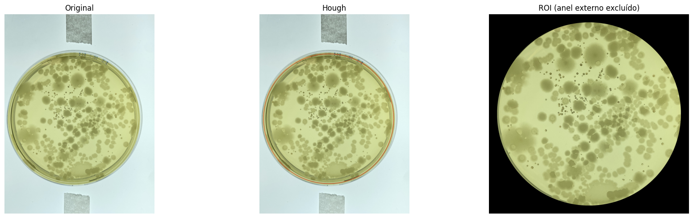

#### 1.3 Análise de canais de cor e histogramas

Com a região da placa isolada, foram analisados histogramas dos canais RGB e diferentes espaços de cor, como HSV, CMYK e CIE Lab. Essa análise foi importante para observar como as intensidades estavam distribuídas dentro da placa e para identificar quais canais ofereciam melhor separação entre colônias e fundo. O uso de CLAHE também foi testado para realçar o contraste local, tornando mais visíveis algumas colônias que apresentavam baixa diferença de intensidade em relação ao ágar. Nos testes realizados, os canais `L` e `b` do espaço Lab apresentaram boa separação em algumas imagens, mas nenhum canal foi suficientemente robusto para todos os casos.

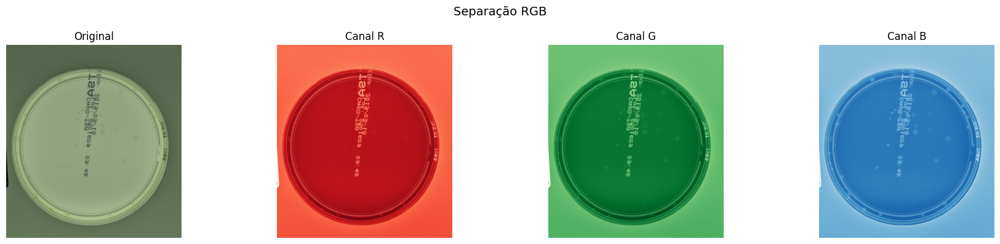
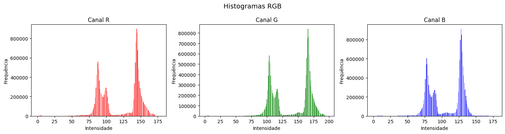
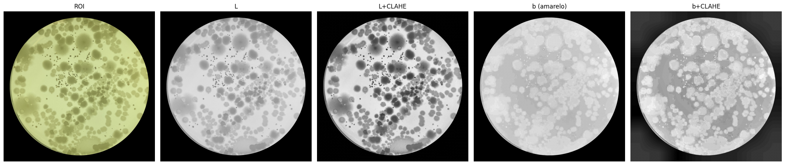
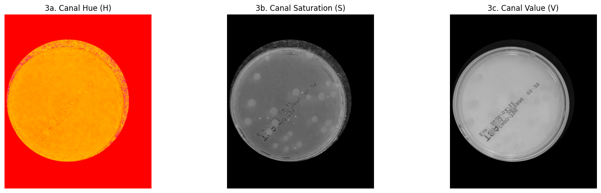

#### Síntese dos problemas observados no pré-processamento

| Etapa | Problema observado | O que ocasionou o problema | Por que não serviu bem para todas as imagens |
|---|---|---|---|
| Conversão e padronização | As imagens continuaram apresentando diferenças visuais relevantes | As bases possuem formatos, resoluções e condições de captura diferentes | A padronização do arquivo resolve a leitura, mas não corrige iluminação, escala ou enquadramento |
| Hough Circles | Em algumas imagens o círculo detectado não coincidiu perfeitamente com a placa | Variações de distância da câmera, ângulo, borda pouco definida e iluminação irregular | Um erro na ROI afeta todas as etapas seguintes, pois pode cortar colônias ou manter regiões externas indesejadas |
| Máscara circular | Presença de bordas, escritas e reflexos mesmo após o recorte | Algumas anotações estão dentro ou próximas à área útil da placa | A máscara circular remove o exterior da placa, mas não separa automaticamente colônias de artefatos internos |
| Seleção de canais | Nenhum canal funcionou de forma universal | Diferenças de cor entre ágar, colônias e microrganismos | Um canal que destaca bem uma imagem pode falhar em outra com contraste ou coloração diferente |

---

### 2. Experimentos de segmentação e contagem com métodos clássicos

#### 2.1 Limiarização global, Otsu e limiarização adaptativa

Foram testadas diferentes estratégias de limiarização para separar as colônias do fundo da placa, incluindo limiar fixo, limiarização de Otsu e limiarização adaptativa gaussiana. Esses métodos foram aplicados após a definição da região de interesse e o realce de contraste. A limiarização de Otsu apresentou limitações importantes, pois o histograma das imagens recortadas era fortemente influenciado pelos pixels zerados fora da placa. Como consequência, o limiar calculado automaticamente foi deslocado para valores pouco adequados, reduzindo a sensibilidade para detectar colônias. A limiarização adaptativa apresentou resultados melhores em algumas imagens, mas ainda foi instável diante de variações de iluminação e contraste.

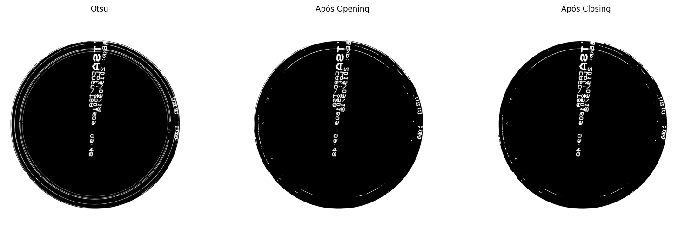
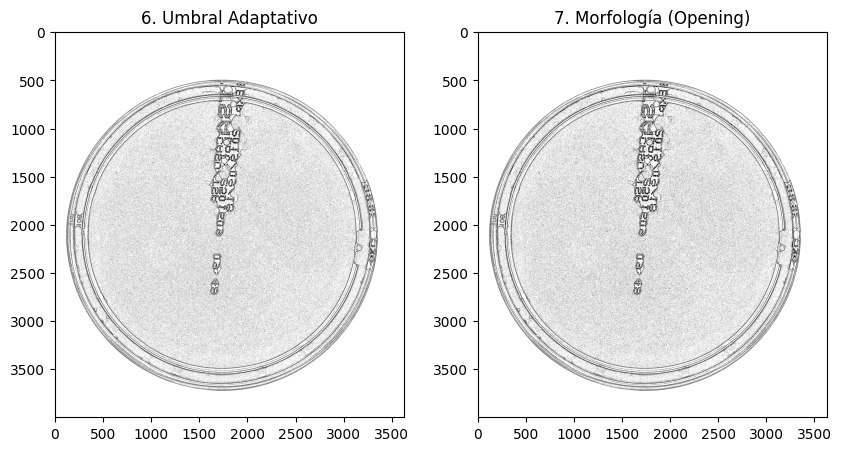

#### 2.2 Subtração de fundo com filtro Gaussiano

Também foi avaliada uma abordagem baseada em subtração de fundo. Nesse experimento, um filtro Gaussiano com kernel de grande dimensão foi utilizado para estimar a variação lenta de iluminação dentro da placa. Em seguida, calculou-se a diferença absoluta entre a imagem suavizada e o fundo estimado, realçando regiões que se destacavam localmente. O resultado foi normalizado e posteriormente binarizado com Otsu. Essa estratégia funcionou melhor em imagens nas quais o fundo apresentava uma variação suave de iluminação, mas perdeu desempenho quando havia colônias maiores, anotações manuscritas ou mudanças mais intensas na aparência do ágar.

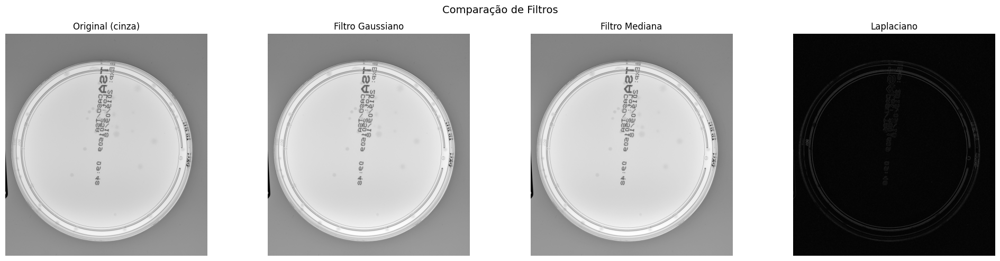

#### 2.3 Clusterização K-Means

Como alternativa aos métodos baseados em limiar, foi aplicado K-Means com `k = 4` sobre os pixels internos da placa, utilizando principalmente os canais `L` e `b` do espaço Lab após CLAHE. Essa abordagem agrupou os pixels por similaridade de cor e luminosidade, reduzindo a dependência de um único limiar global. Em algumas amostras, o K-Means apresentou resultados mais consistentes que a limiarização, especialmente em casos com variação moderada de iluminação. Entretanto, o método continuou apresentando dificuldades quando a tonalidade das colônias era muito próxima à do ágar, pois o cluster correspondente às colônias deixava de ser claramente separável.

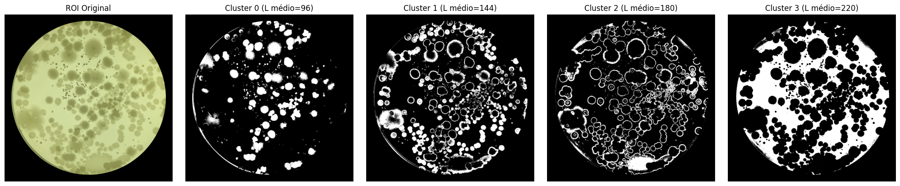

#### 2.5 Separação de colônias sobrepostas com Watershed

Após a obtenção das máscaras binárias, foi aplicado o algoritmo Watershed associado à transformada de distância para separar colônias conectadas ou parcialmente sobrepostas. A transformada de distância permitiu localizar possíveis centros das colônias, que foram usados como marcadores para a propagação das regiões. O método funcionou de forma satisfatória em casos de sobreposição parcial, nos quais ainda havia centros distinguíveis. No entanto, quando as colônias estavam completamente fundidas ou apresentavam contornos pouco definidos, o algoritmo não foi capaz de separar corretamente as instâncias, resultando em subcontagem. Essa limitação também foi observada nas anotações do grupo, especialmente para casos de colônias muito próximas ou confluentes.

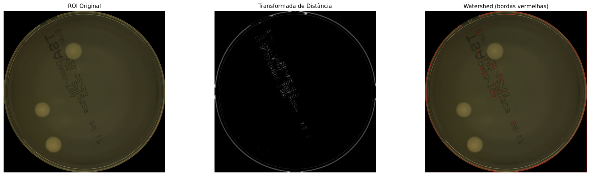

#### 2.6 Contagem por componentes conectados e filtros geométricos

A etapa de contagem foi realizada a partir da rotulagem de componentes conectados presentes nas máscaras binárias. Cada região branca contígua foi interpretada como uma candidata a colônia. Para reduzir falsos positivos, foram aplicados filtros por área, circularidade e solidez. A circularidade foi usada porque muitas colônias apresentam formato aproximadamente circular, enquanto fragmentos de letras e ruídos tendem a produzir formas alongadas ou irregulares. A solidez ajudou a descartar componentes com contornos muito fragmentados. Essa combinação reduziu falsos positivos, mas a contagem continuou dependente da qualidade da segmentação inicial. Quando a máscara continha colônias unidas, partes de escrita ou regiões mal segmentadas, os filtros geométricos não eram suficientes para corrigir o erro.

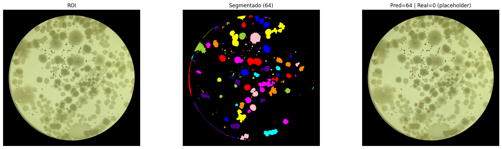

#### Síntese dos problemas observados nos métodos clássicos

| Experimento | Resultado preliminar | Problema observado | O que ocasionou o problema | Por que não serviu bem para essas imagens |
|---|---|---|---|---|
| Limiar fixo | Funcionou apenas em imagens visualmente semelhantes às usadas para calibração | Baixa generalização | Diferenças de iluminação, contraste e cor do ágar | Um único valor de limiar não representa bem todo o conjunto |
| Otsu | Automatizou a escolha do limiar, mas falhou em várias imagens | Limiar deslocado | Histograma dominado por pixels zerados da máscara e fundo | A separação estatística entre fundo e colônia não ficou bem definida |
| Limiarização adaptativa | Melhorou alguns casos locais | Resultado inconsistente | Sensibilidade ao tamanho da vizinhança e à iluminação | Detectou ruídos e falhou em regiões com baixo contraste |
| Subtração de fundo | Realçou colônias em placas com iluminação suave | Erros em colônias grandes e anotações | Escritas, variações fortes de fundo e morfologias diferentes | O método assume que o fundo varia lentamente e que as colônias são pequenas |
| K-Means | Foi mais estável que limiarização em algumas amostras | Confusão entre colônia e ágar | Tonalidades semelhantes entre classes | Quando as cores se sobrepõem, os clusters deixam de representar objetos reais |
| Watershed | Separou sobreposições parciais | Não separou colônias fundidas | Ausência de máximos locais bem definidos | Colônias completamente conectadas aparecem como uma única região |
| Componentes conectados + filtros | Reduziu falsos positivos simples | Não corrigiu erros da segmentação | Máscaras com regiões fundidas, letras ou ruídos | A filtragem geométrica atua depois da segmentação e não recupera objetos perdidos |

---

### 3. Experimentos com aprendizado profundo

#### 3.1 Detecção de colônias com YOLOv5s no dataset AGAR

Para avaliar uma abordagem baseada em aprendizado profundo, foi realizado o fine-tuning de um modelo YOLOv5s pré-treinado. O treinamento utilizou o dataset AGAR após a remoção das imagens consideradas incontáveis, resultando em 13.489 imagens. Os dados foram divididos em 70% para treino e 30% para validação, com treinamento por 100 épocas, `batch size = 32` e imagens redimensionadas para `640 x 640`. No conjunto de validação do AGAR, o modelo apresentou bons resultados, com precisão de 98%, recall de 95%, mAP@0.5 de 96% e mAP@0.5:0.95 de 94%. Esses valores indicam que o modelo aprendeu bem o padrão visual do AGAR, mas a inferência direta em imagens do CNPEM apresentou queda de desempenho, evidenciando a diferença de domínio entre as bases. 

| Métrica | Valor |
|---|---:|
| Precisão | 98% |
| Recall | 95% |
| mAP@0.5 | 96% |
| mAP@0.5:0.95 | 94% |

#### 3.2 Adaptação de domínio com YOLOv5s-seg no dataset CNPEM

Em seguida, foi testada uma estratégia de adaptação de domínio utilizando imagens do CNPEM anotadas manualmente com máscaras de segmentação. O modelo treinado anteriormente no AGAR foi utilizado como ponto de partida para um modelo de segmentação baseado em YOLOv5s-seg. Mesmo com poucas imagens anotadas, os resultados preliminares mostraram segmentações visualmente razoáveis em algumas imagens do CNPEM. No entanto, as máscaras ainda apresentaram imprecisões nos contornos, principalmente em colônias maiores, regiões de sobreposição e imagens com baixo contraste. Isso indica que a adaptação de domínio é viável, mas depende da ampliação e melhoria das anotações de segmentação.

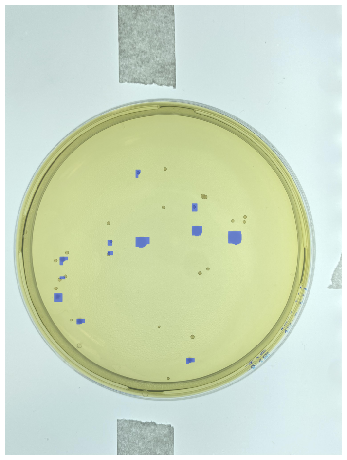

#### 3.3 Enriquecimento de anotações com SAM 2.1

Como proposta para melhorar o treinamento dos modelos de segmentação, foi iniciado o uso do SAM 2.1 para gerar máscaras automaticamente a partir das bounding boxes disponíveis no dataset AGAR. Como o AGAR já possui anotações de detecção, o SAM permite transformar parte dessas anotações em máscaras, enriquecendo o conjunto de dados para segmentação de instâncias. Essa etapa ainda precisa ser validada visual e quantitativamente, pois máscaras automáticas incorretas podem introduzir ruído no treinamento. Mesmo assim, a abordagem é promissora para aumentar a quantidade de dados segmentados sem depender exclusivamente de anotação manual.

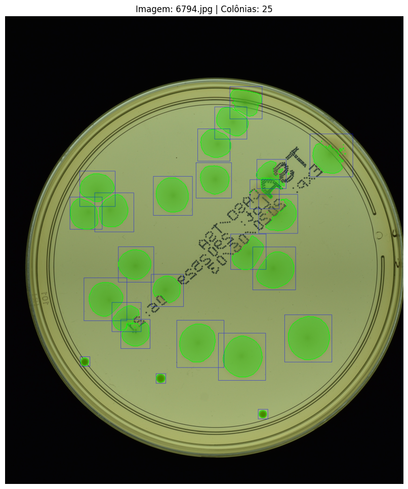

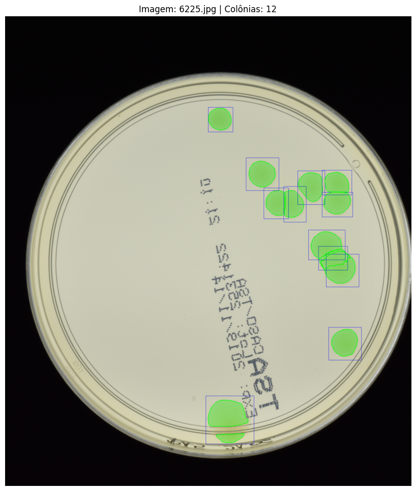

#### Síntese dos problemas observados nos métodos de aprendizado profundo

| Experimento | Resultado preliminar | Problema observado | O que ocasionou o problema | Por que ainda não resolve completamente |
|---|---|---|---|---|
| YOLOv5s no AGAR | Alto desempenho no conjunto de validação do AGAR | Queda ao aplicar no CNPEM | Diferença de domínio entre datasets | O modelo aprendeu bem o AGAR, mas não generalizou diretamente para outro protocolo de aquisição |
| YOLOv5s-seg no CNPEM | Segmentações razoáveis com poucas imagens | Contornos imprecisos | Pouca quantidade de máscaras anotadas | O modelo precisa de mais exemplos para aprender variações de forma, tamanho e sobreposição |
| SAM 2.1 para máscaras | Geração automática de máscaras a partir de bounding boxes | Necessidade de validação das máscaras | Segmentação automática pode gerar erros | Máscaras incorretas podem prejudicar o treinamento supervisionado |
| Adaptação de domínio | Estratégia mostrou potencial | Dependência de anotação manual | O CNPEM possui poucas anotações espaciais | A qualidade final depende da ampliação do conjunto anotado |
## Próximos passos

Para a conclusão do projeto, as próximas etapas foram organizadas considerando as pendências técnicas, experimentais e de documentação. O foco principal será consolidar os resultados dos métodos clássicos, ampliar a adaptação de domínio para o dataset CNPEM e organizar a análise comparativa final entre as abordagens testadas.

| Etapa | Descrição | Entrega esperada |
|---|---|---|
| Revisão das anotações do CNPEM | Revisar as máscaras já anotadas manualmente, corrigindo contornos inconsistentes e removendo anotações ambíguas. Essa etapa é necessária porque a qualidade das máscaras influencia diretamente o treinamento do modelo de segmentação. | Conjunto revisado de máscaras do CNPEM |
| Ampliação do conjunto anotado | Aumentar a quantidade de imagens do CNPEM com máscaras de segmentação, priorizando imagens com colônias maiores, sobrepostas e com diferentes meios de cultura. | Novo subconjunto anotado para fine-tuning |
| Geração de máscaras com SAM 2.1 | Utilizar o SAM 2.1 para gerar máscaras a partir das bounding boxes do dataset AGAR, avaliando visualmente a qualidade das segmentações geradas automaticamente. | Máscaras geradas automaticamente para parte do AGAR |
| Validação das máscaras automáticas | Comparar qualitativamente as máscaras geradas pelo SAM 2.1 com exemplos anotados manualmente, identificando erros comuns como vazamento de contorno, segmentação parcial ou inclusão de fundo. | Conjunto filtrado de máscaras consideradas úteis |
| Novo treinamento com 5s-seg | Realizar novo fine-tuning do modelo de segmentação usando as máscaras revisadas do CNPEM e, se possível, as máscaras enriquecidas do AGAR. Modelo de segmentação atualizado |
| Consolidação dos métodos clássicos | Selecionar os melhores resultados obtidos com limiarização, subtração de fundo, morfologia, K-Means, Watershed e filtros geométricos. | Tabela comparativa dos métodos clássicos |
| Avaliação quantitativa final | Calcular métricas de contagem, detecção e segmentação, como MAE, sMAE, precisão, recall, mAP e IoU, conforme a disponibilidade de ground truth em cada base. | Resultados quantitativos finais |
| Análise crítica dos resultados | Comparar os métodos clássicos e os métodos baseados em deep learning, discutindo vantagens, limitações, capacidade de generalização e custo computacional. | Discussão crítica para o relatório final |
| Organização das figuras e workflow | Inserir no README as imagens dos experimentos, o workflow do projeto e exemplos visuais dos principais resultados obtidos. | README com figuras organizadas |
| Escrita e revisão final da entrega | Revisar o texto final, corrigir formatação em Markdown, conferir referências, datasheet, links e seção de uso de IA generativa. | Versão final da Entrega 2 |

## Uso de IA Generativa

Durante o desenvolvimento do projeto, ferramentas de IA generativa foram utilizadas como apoio em tarefas de escrita, revisão, tradução, organização do README, interpretação de erros de código e melhoria da documentação. As ferramentas não foram utilizadas para gerar resultados experimentais automaticamente nem para substituir a análise crítica do grupo. Os resultados, decisões metodológicas e interpretações finais foram revisados pelos integrantes do projeto.

| Tarefa | Ferramenta utilizada | Prompt utilizado | Uso no projeto |
|---|---|---|---|
| Revisão de texto em português | ChatGPT | "Corrija a gramática e melhore a clareza deste parágrafo mantendo o sentido original." | Revisão de trechos da descrição do projeto, metodologia e resultados preliminares |
| Tradução de trechos técnicos | ChatGPT | "Traduza este trecho do espanhol para o português acadêmico, mantendo os termos técnicos de processamento de imagens." | Tradução e adaptação de anotações internas do grupo para o README |
| Correção de código Python | ChatGPT | "Este código em Python está gerando erro. Explique o erro e sugira uma correção sem mudar a lógica principal." | Apoio na identificação de erros de sintaxe, leitura de imagens, manipulação de arrays e uso de bibliotecas |
| Criação de tabelas em Markdown | ChatGPT | "Transforme estas informações em uma tabela Markdown organizada." | Criação de tabelas comparativas de bases de dados, ferramentas, próximos passos e problemas observados |
| Geração de ideias para workflow | ChatGPT | "Sugira um workflow visual para um projeto de segmentação, detecção e contagem de colônias em placas de Petri." | Apoio na definição dos blocos principais do workflow do projeto |

## Referências

  Beucher, S., & Meyer, F. (1993). *The morphological approach to segmentation: the watershed transformation*. Mathematical Morphology in Image Processing, 34, 433–481.

  Bradley, D., & Roth, G. (2007). *Adaptive thresholding using the integral image*. Journal of Graphics Tools, 12(2), 13–21. Disponível em: https://www.taylorfrancis.com/chapters/edit/10.1201/9781482277234-12/morphological-approach-segmentation-watershed-transformation-beucher-meyer

  Bradski, G., & Kaehler, A. (2008). *Learning OpenCV: Computer Vision with the OpenCV Library*. O'Reilly Media. Disponível em: https://www.hlevkin.com/hlevkin/45MachineDeepLearning/ML/Learning-OpenCV.pdf

  Chiang, P.-J., Tseng, M.-J., He, Z.-S., & Li, C.-H. (2015). *Automated counting of bacterial colonies by image analysis*. Journal of Microbiological Methods, 108, 74–82. https://doi.org/10.1016/j.mimet.2014.11.009

  Dolu, M., Altıntaş, M. E., Duman, E., & Kılıç, G. B. (2025). YOLO-Based Counting of Small and Overlapping Bacterial Colonies: Performance Analysis and Real-Time Mobile Deployment. 2025 10th International Conference on Computer Science and Engineering (UBMK), 1042–1046. https://doi.org/10.1109/UBMK67458.2025.11206979

  Galope, R., Lisondra, C., & Nanual, A. (2024). Automated Bacteria Colony Counting using Hybrid Image Segmentation Algorithm and YOLOv5 Transfer Learning Model. International Conference on Innovative Practices in Management, Engineering & Social Sciences, IPMESS-24. https://doi.org/10.37082/IJIRMPS.IPMESS-24.6

  Gonzalez, R. C., & Woods, R. E. (2018). *Digital Image Processing* (4th ed.). Pearson.

  Haralick, R. M., Sternberg, S. R., & Zhuang, X. (1987). *Image analysis using mathematical morphology*. IEEE Transactions on Pattern Analysis and Machine Intelligence, 9(4), 532–550. Disponível em: https://ieeexplore.ieee.org/document/4767941

  He, L., Ren, X., Gao, Q., Zhao, X., Yao, B., & Chao, Y. (2017). *The connected-component labeling problem: A review of state-of-the-art algorithms*. Pattern Recognition, 70, 25–43. Disponível em: https://www.sciencedirect.com/science/article/pii/S0031320317301693

  Hough, P. V. C. (1962). *Method and means for recognizing complex patterns*. U.S. Patent 3,069,654.

  Jiang, H., Guo, Q., Zhi, X., Li, H., & Chen, Y. (2026). A weakly supervised framework for automated biological assay assessment. Virus Research, 363, 199677. https://doi.org/10.1016/j.virusres.2025.199677

  Jocher, G., et al. (2020). *ultralytics/yolov5*. Zenodo. https://doi.org/10.5281/zenodo.3908559

  Majchrowska, S., Pawłowski, J., Guła, G., Bonus, T., Hanas, A., Loch, A., Pawlak, A., Roszkowiak, J., Golan, T., & Drulis-Kawa, Z. (2021). *AGAR: A microbial colony dataset for deep learning detection*. Disponível em: arXiv. https://arxiv.org/abs/2108.01234

  Otsu, N. (1979). *A threshold selection method from gray-level histograms*. IEEE Transactions on Systems, Man, and Cybernetics, 9(1), 62–66. Disponível em: https://ieeexplore.ieee.org/document/4310076

  Ravi, N., et al. (2024). *SAM 2: Segment Anything in Images and Videos*. arXiv:2408.00714. Disponível em: https://arxiv.org/abs/2408.00714 

  Seo, J.-W., & Kim, S.-D. (2013). *Novel PCA-based color-to-gray image conversion*. In 2013 IEEE International Conference on Image Processing (ICIP), pp. 2279–2283. https://doi.org/10.1109/ICIP.2013.6738470

  Sezgin, M., & Sankur, B. (2004). *Survey over image thresholding techniques and quantitative performance evaluation*. Journal of Electronic Imaging, 13(1), 146–168.

  Wong, C.-F., Joshua Yi, Y., & Samuel Ken-En, G. (2016). *APD colony counter app: Using Watershed algorithm for improved colony counting*.
