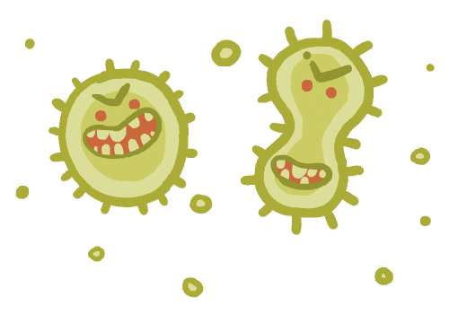
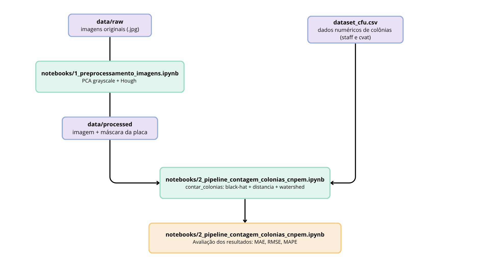
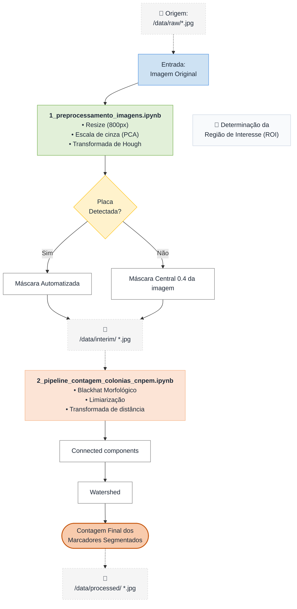
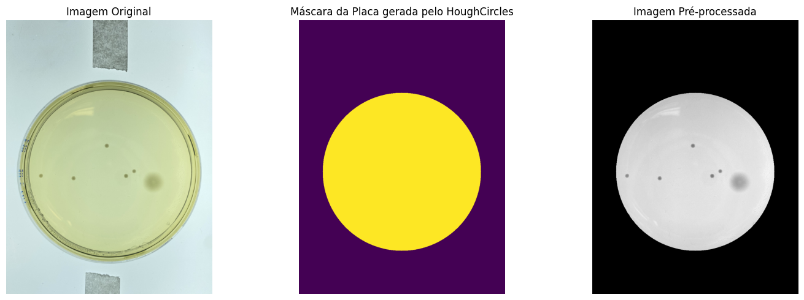
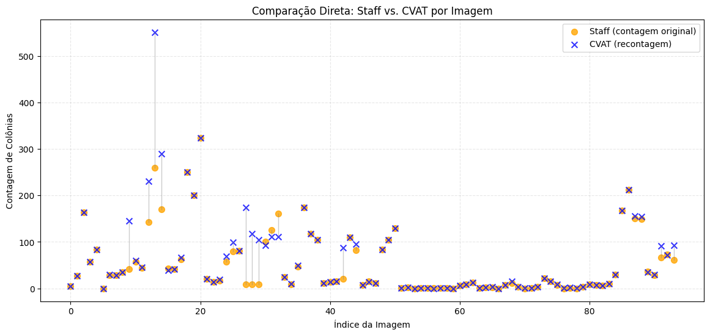
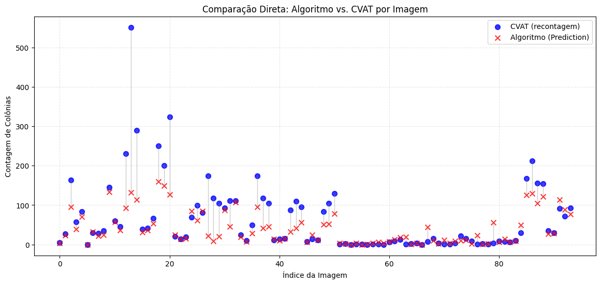

# Reconhecimento de padrões em Placas de Petri

# Pattern Recognition in Petri Dishes

> **Counting microbes with Math, not Magic.** 

## Apresentação

O presente projeto foi originado no contexto das atividades da disciplina de pós-graduação *IA901 - Análise de Imagens e Reconhecimento de Padrões*,
oferecida no primeiro semestre de 2026, na Unicamp, sob supervisão da Profa. Dra. Leticia Rittner, do Departamento de Engenharia de Computação e Automação (DCA) da Faculdade de Engenharia Elétrica e de Computação (FEEC).

> |Nome  | RA | Curso|
> |--|--|--|
> | Leonardo Rafael Pires  | 178589  | Aluno Especial|
> | Laura Vieira Malachias   | 299117  | Mestranda em Tecnologia|
> | Gabriela Morales Soto  | 299213  | Mestranda em Ciência da Computação|

Este projeto é dedicado à exploração de um pipeline clássico de Processamento Digital de Imagens para a contagem automatizada de colônias de bactérias em placas de Petri do dataset CNPEM, e à avaliação rigorosa desse pipeline contra duas referências humanas independentes para a mesma placa.

---

## Descrição do Projeto

## Objetivos

### Objetivo geral

Desenvolver e avaliar um pipeline de detecção e contagem automática de colônias em placas de Petri do dataset CNPEM, utilizando técnicas clássicas de visão computacional, e verificar se o erro do método automático em relação à contagem humana mais cuidadosa (CVAT - Computer Vision Annotation Tool) é compatível com a própria divergência observada entre dois contadores humanos da mesma placa (`staff` vs. `cvat`).

### Objetivos específicos

- Realizar pré-processamento das imagens para a análise computacional.
- Detectar automaticamente a região de interesse correspondente à placa de Petri.
- Separar colônias parcialmente sobrepostas usando.
- Quantificar o erro do pipeline (MAE, RMSE, MAPE) contra duas referências de contagem humana — `staff` (contagem original do analista) e `cvat` (recontagem feita com apoio de anotação de instâncias no CVAT) - e comparar essas duas métricas de erro entre si.

### Metodologia

A metodologia segue a linha de um pipeline clássico de visão computacional para contagem de colônias bacterianas, inspirado no método descrito por Chiang et al. (2015), que combina conversão de cor baseada em componentes principais, limiarização e separação de objetos sobrepostos por meio da Transformada de Distância e do algoritmo Watershed.

A implementação foi organizada em dois notebooks principais. O notebook `1_preprocessamento_imagens.ipynb` realiza as etapas de pré-processamento descritas nas Seções 1 a 3, incluindo a preparação e o realce das imagens para a segmentação. Em seguida, o notebook `2_pipeline_contagem_colonias_cnpem.ipynb` executa o procedimento de segmentação e contagem das colônias, além da análise estatística dos resultados obtidos. O raciocínio de cada etapa é descrito a seguir, na ordem em que é executado no pipeline.

### 1. Aquisição dos dados

O conjunto de dados utilizado é o CNPEM (Centro Nacional de Pesquisa em Energia e Materiais), composto por imagens de placas de Petri adquiridas sob condições padronizadas de captura. As fotografias foram obtidas com um iPhone 16, posicionado a 20 cm acima da placa, utilizando zoom de 2,5×. Durante a aquisição, as placas foram colocadas sobre uma placa iluminadora com intensidade luminosa de aproximadamente 16.000 lux, garantindo iluminação uniforme e reprodutível.

Cada imagem possui duas contagens humanas de referência associadas: **`staff`**, correspondente à contagem original realizada pelo analista no momento do experimento, e **`cvat`**, uma recontagem posterior mais criteriosa, apoiada pela anotação manual de instâncias na ferramenta CVAT (Computer Vision Annotation Tool). A disponibilidade dessas duas referências humanas independentes para uma mesma placa permite avaliar o desempenho do algoritmo em relação à variabilidade inerente ao processo de contagem manual, comparando o erro do método automático com a divergência naturalmente observada entre diferentes avaliadores.

### 2. Pré-processamento: conversão para escala de cinza via PCA

A conversão clássica de RGB para escala de cinza usa uma combinação fixa e pré-definida dos canais R, G e B (aproximadamente `0.299R + 0.587G + 0.114B`), calibrada para a percepção visual humana, não para maximizar o contraste entre objetos de interesse. Em imagens de placas de Petri, esse contraste pode estar concentrado de forma desigual entre os canais, por exemplo, colônias amareladas sobre ágar avermelhado, de modo que ao combinar sinal e ruído de maneira inadequada, a fórmula fixa pode mascarar colônias de baixo contraste.

Para contornar essa limitação, o pipeline converte cada imagem para escala de cinza projetando os pixels RGB sobre a sua primeira componente principal (PCA), em vez de usar pesos fixos. Como colônia e fundo são, por definição, as duas regiões de maior diferença de cor na placa, a direção de máxima variância entre os canais tende a coincidir com a direção que melhor separa colônia de ágar, produzindo uma imagem em escala de cinza com maior contraste relativo entre os dois. Essa abordagem é descrita por Seo & Kim (2013), que propõem a conversão color-to-gray baseada em PCA como alternativa à ponderação fixa de canais justamente para preservar a discriminabilidade entre regiões de cor diferente, e é a mesma lógica de conversão usada por Chiang et al. (2015) como primeira etapa do seu pipeline de contagem de colônias bacterianas, antes da limiarização de Otsu.

Na prática, a imagem `(H, W, 3)` é reorganizada em uma matriz de pixels `(H·W, 3)`, sobre a qual se ajusta um PCA com uma única componente; a projeção resultante (que pode conter valores negativos ou fora de `[0, 255]`) é normalizada linearmente de volta para uma imagem `uint8` de um canal, compatível com o restante do pipeline em OpenCV.

### 3. Definição da região de interesse (Transformada de Hough)

Sobre a imagem em escala de cinza (já convertida via PCA) e suavizada por um filtro de mediana, é aplicada a Transformada de Hough para círculos (Hough, 1962), que detecta a circunferência correspondente à borda da placa de Petri:

$$
(x - a)^2 + (y - b)^2 = r^2
$$

em que $(a,b)$ é o centro da circunferência e $r$ o raio detectado. A partir do círculo encontrado, gera-se uma máscara binária que restringe todo o processamento subsequente à área interna da placa, descartando bancada, sombras e bordas do recipiente, regiões que, se não removidas, produziriam falsos positivos na etapa de segmentação. Quando a Transformada de Hough não encontra um círculo válido, o pipeline usa como fallback uma máscara central de raio fixo, evitando que a ausência de detecção interrompa o processamento em lote.

### 4. Realce de colônias via operador morfológico Black-Hat

Dentro da região da placa, aplica-se o operador morfológico Black-Hat sobre a imagem em escala de cinza:

$$
\text{BlackHat}(f) = (f \bullet B) - f
$$

em que $f \bullet B$ é o fechamento morfológico de $f$ pelo elemento estruturante $B$, definido como um elemento elíptico de $35\times35$ pixels. 
O Black-Hat realça estruturas escuras menores que o elemento estruturante sobre um fundo mais claro, que é o padrão esperado de colônias (mais escuras) sobre o ágar (mais claro). Esse tipo de operação morfológica de realce de estruturas locais é descrito por Haralick et al. (1987) como uma das aplicações fundamentais da morfologia matemática em análise de imagens, sendo preferível a um threshold direto sobre a imagem original porque cancela variações lentas e globais de iluminação no fundo, mantendo apenas o sinal de alta frequência associado às colônias.

### 5. Limiarização e limpeza morfológica

A imagem realçada pelo Black-Hat é binarizada por um limiar fixo (`sensibilidade_thresh`):

$$
g(i,j) =
\begin{cases}
255, & \text{se } \text{BlackHat}(i,j) > T \\
0, & \text{caso contrário}
\end{cases}
$$

seguida de uma abertura morfológica com kernel $3\times3$ para remover ruído de granulação fina sem apagar colônias pequenas. Como o Black-Hat já normaliza boa parte da variação global de iluminação antes da binarização, um limiar fixo torna-se uma escolha estável nesta etapa, diferente da limiarização direta sobre a imagem em escala de cinza original, em que um único limiar tende a não generalizar entre placas com fundos de tonalidade diferente.

### 6. Separação de colônias sobrepostas (Transformada de Distância + Watershed)

Colônias que se sobrepõem parcialmente aparecem na máscara binária como um único componente conectado, levando à subcontagem se não forem tratadas. Para separá-las, o pipeline aplica a Transformada de Distância sobre a máscara limpa, atribuindo a cada pixel de colônia a distância até o pixel de fundo mais próximo. Picos dessa transformada correspondem aos centros prováveis de cada colônia individual e são usados como marcadores (`sure_fg`) para o algoritmo Watershed (Beucher & Meyer, 1993), que propaga fronteiras a partir desses marcadores até as regiões de incerteza entre eles, separando colônias adjacentes em rótulos distintos. Essa combinação (distância + watershed) é a mesma estratégia empregada por Chiang et al. (2015) para dividir colônias clusterizadas após a segmentação por PCA e Otsu, e também aparece em Wong et al. (2016) como melhoria sobre limiarização simples para casos de colônias parcialmente fundidas.

### 7. Contagem por componentes conectados e filtro de área

Cada rótulo distinto produzido pelo algoritmo Watershed é interpretado como uma colônia candidata. Em seguida, aplica-se um filtro de área mínima (`área > 8` pixels) para remover pequenos fragmentos residuais, geralmente associados a ruído de textura do ágar ou a imperfeições remanescentes da segmentação. Não foi necessário empregar filtros adicionais baseados em forma, uma vez que as etapas anteriores de realce por Black-Hat e limpeza morfológica já eliminam a maior parte dos artefatos não circulares. Assim, a contagem final de colônias corresponde ao número de componentes rotulados que satisfazem o critério de área mínima:

$$
N_{\text{colônias}} = \sum_{k \geq 1} \mathbf{1}(A_k > A_{\min})
$$

em que $A_k$ representa a área do componente associado ao rótulo $k$, $A_{\min}$ corresponde à área mínima admissível e $\mathbf{1}(\cdot)$ denota a função indicadora. Assim, cada componente contribui com uma unidade para a soma apenas quando sua área excede o limiar estabelecido, resultando na contagem total de colônias válidas.

### 8. Avaliação: algoritmo vs. duas referências humanas

A avaliação não compara o algoritmo contra um único "ground truth", pois não existe, estritamente, uma contagem manual isenta de erro: `staff` e `cvat` são duas estimativas humanas independentes da mesma quantidade real de colônias, e a literatura de contagem manual de colônias (Chiang et al., 2015) já reconhece a contagem visual como tarefa sujeita a fadiga e inconsistência entre repetições. Por isso, o notebook primeiro quantifica a divergência entre `staff` e `cvat` (MAE, RMSE, MAPE) como uma linha de base de "erro humano", e só então compara o algoritmo contra cada uma das duas referências separadamente, usando as mesmas métricas, acrescidas de viés médio e correlação de Pearson/R² para capturar tendência sistemática de sub ou sobrecontagem. Se o erro do algoritmo em relação a `cvat` for da mesma ordem de grandeza do erro entre `staff` e `cvat`, isso sustenta o argumento de que parte do "erro" do método automático reflete a ambiguidade inerente à tarefa de contagem visual, e não exclusivamente uma falha do método.

## Bases de Dados

O datasheet for datasets pode ser consultado aqui: [Datasheet](IA901-2026S1/projetos/pattern-recognition-in-petri-dishes/assets/datasheet.md)

Base de Dados | Resumo descritivo | Endereço na Web
----- | ----- | -----
Dataset CNPEM (LNNano) — interno| Dataset coletado por pesquisadores do CNPEM (LNNano), contendo imagens de colônias de bactérias e fungos em placas de Petri, com variação no meio de cultura e condições padronizadas de aquisição. Cada imagem possui duas contagens de referência: `staff` (contagem original do analista) e `cvat` (recontagem mais cuidadosa, apoiada por anotação de instâncias no CVAT).|https://1drv.ms/f/c/ab5109ec6b881bc2/IgCoHt5JsShGSIm4lrKCn3rvASVMI3zXC6TBj2YiSYWSX78?e=njq0hx

## Ferramentas

As ferramentas e bibliotecas utilizadas no pipeline atual estão listadas a seguir:

- **Python 3** — linguagem principal utilizada no desenvolvimento do pipeline
- **OpenCV** — Transformada de Hough, operações morfológicas (Black-Hat, abertura), limiarização, Transformada de Distância, Watershed e rotulagem de componentes conectados
- **scikit-learn** — PCA para conversão da imagem RGB em escala de cinza de contraste otimizado, e métricas de erro (MAE, RMSE, MAPE)
- **NumPy** — operações matriciais e manipulação dos arrays de imagem
- **Pandas** — leitura e manipulação da tabela `dataset_cfu_cvat.csv` com as contagens de referência
- **Matplotlib** — visualização das etapas do pipeline e dos gráficos comparativos staff/cvat/algoritmo
- **CVAT** — ferramenta utilizada para a recontagem manual mais cuidadosa (`cvat`) usada como referência principal

## Workflow

O workflow do projeto foi organizado para representar as principais etapas necessárias para reproduzir os experimentos, desde a preparação das bases de dados até a avaliação dos métodos clássicos e baseados em aprendizado profundo.

<!--  -->

> Arquivos relacionados

- 📓 [Notebook 1](./notebooks/1_preprocessamento_imagens.ipynb)
- 📓 [Notebook 2](./notebooks/2_pipeline_contagem_colonias_cnpem.ipynb)
- 📂 [Dados brutos](./data/raw)
- 📂 [Dados intermediários](./data/interim)
- 📂 [Dados processados](./data/processed)

## Experimentos e Resultados 
Nesta etapa do projeto, o pipeline foi consolidado em dois notebooks principais: um notebook de pré-processamento das imagens (`1_preprocessamento_imagens.ipynb`) e um notebook de detecção e contagem de colônias (`2_pipeline_contagem_colonias_cnpem.ipynb`). Juntos, eles implementam um pipeline clássico de visão computacional, desde a padronização das imagens até a avaliação quantitativa do algoritmo contra duas contagens humanas independentes.

### 1. Pré-processamento das imagens 

O objetivo desta etapa é padronizar a entrada visual das imagens do dataset CNPEM, reduzindo variações irrelevantes de fundo, iluminação e escala antes da etapa de contagem.

#### Pipeline implementado:
* **Padronização de tamanho:** Todas as imagens são redimensionadas para largura fixa de 800 pixels, mantendo a proporção original.
* **Conversão para escala de cinza via PCA:** Em vez de uma conversão RGB→cinza tradicional, os três canais de cor são condensados em uma única componente principal (PCA), normalizada de volta para 8 bits. Essa abordagem busca realçar o contraste global entre colônias e ágar.
* **Detecção da placa com HoughCircles:** Aplicada sobre a imagem suavizada (blur mediano) para localizar centro e raio da placa de Petri.
* **Fallback robusto:** Quando o círculo não é detectado automaticamente, uma máscara circular central padrão é usada no lugar.
* **Aplicação da máscara circular:** Raio reduzido a 86% do raio detectado para remover a região externa à placa.

O resultado é salvo em data/processed, preservando o nome original de cada arquivo, para ser consumido diretamente pelo notebook de contagem.

| Etapa | Parâmetro |
| :--- | :--- |
| **Largura padronizada** | 800 px |
| **Blur (mediana)** | kernel 21 |
| **HoughCircles** | dp=1.2, minDist=100, param1=50, param2=30, minRadius=200, maxRadius=400 |
| **Raio da máscara final** | 86% do raio detectado |

### 2. Detecção e contagem de colônias 

Com as imagens pré-processadas, foi implementado o pipeline de contagem baseado no método de *Chiang et al. (2014)*, utilizando Transformada de Distância e Watershed para separar colônias sobrepostas.

#### Pipeline implementado:
* **Realce via Black-Hat:** Operação morfológica (kernel elíptico 35×35) que realça estruturas escuras (colônias) sobre fundo claro (ágar).
* **Binarização:** Threshold fixo (sensibilidade = 12) seguido de limpeza morfológica (abertura, kernel 3×3) para remover ruídos pequenos.
* **Separação de colônias sobrepostas (Watershed):**
  * Cálculo da região de fundo certo (dilatação);
  * Transformada de Distância para localizar centros prováveis das colônias;
  * Identificação da região de fronteira desconhecida entre colônias próximas;
  * Rotulagem dos marcadores e aplicação do Watershed.
* **Contagem final:** Feita por componentes conectados, com filtro de área mínima (> 8 px) para descartar ruídos residuais, e desenho do contorno de cada colônia detectada na imagem de saída.

### 3. Avaliação quantitativa: algoritmo vs. contagem humana

A avaliação foi feita sobre **94 imagens** do dataset CNPEM, comparando o algoritmo contra duas contagens humanas independentes da mesma placa:
* **staff:** Contagem original do analista, feita durante a rotina de laboratório;
* **cvat:** Recontagem posterior, mais cuidadosa, realizada com apoio da ferramenta de anotação visual CVAT, colônia a colônia.

#### 3.1 Divergência entre as duas contagens humanas (staff vs. cvat)

| Métrica | Valor |
| :--- | :--- |
| **MAE** | 13,41 colônias |
| **RMSE** | 43,23 colônias |
| **MAPE** | 14,05% |

Mesmo entre dois contadores humanos analisando a mesma placa, há uma divergência relevante. Isso é uma evidência de que a contagem manual está sujeita a uma margem de erro própria, decorrente do esforço cognitivo da tarefa, especialmente em placas muito povoadas.

#### 3.2 Algoritmo vs. staff e vs. cvat

| Comparação | MAE | RMSE | MAPE |
| :--- | :---: | :---: | :---: |
| **Algoritmo vs. staff** | 22,14 | 39,29 | 100,33% |
| **Algoritmo vs. cvat** | 29,94 | 63,66 | 134,28% |
| **staff vs. cvat (referência)** | 13,41 | 43,23 | 14,05% |

O erro do algoritmo em relação a ambas as referências humanas foi maior do que a divergência observada entre as duas contagens humanas entre si. Isso indica que o pipeline clássico atual (Black-Hat + Watershed) ainda não atinge a consistência de um segundo contador humano, subestimando ou superestimando a contagem principalmente nas placas mais povoadas.

#### 3.3 Placas com maior divergência entre staff e cvat

As maiores divergências entre os dois contadores humanos se concentraram justamente nas placas mais povoadas, os casos mais custosos para a contagem manual:

| Imagem | staff | cvat | Diferença |
| :--- | :---: | :---: | :---: |
| `IMG_0529.jpg` | 260 | 551 | 291 |
| `IMG_0561.jpg` | 9 | 174 | 165 |
| `IMG_0531.jpg` | 170 | 290 | 120 |
| `IMG_0563.jpg` | 9 | 118 | 109 |
| `10_3_i.jpg` | 42 | 145 | 103 |

#### 3.4 Gráficos comparativos

Foram gerados dois gráficos de dispersão (índice da imagem × contagem de colônias), conectando os pares de valores comparados por uma linha vertical para facilitar a leitura da magnitude do erro placa a placa:
* **Staff vs. CVAT:** Evidencia visualmente a divergência entre as duas contagens humanas da mesma placa.
  

* **Algoritmo vs. CVAT:** Evidencia visualmente a proximidade (ou distância) entre a predição automática e a recontagem mais cuidadosa.
  

### Síntese dos resultados 

| Notebook | O que faz | Resultado obtido |
| :--- | :--- | :--- |
| `1_preprocessamento_imagens.ipynb` | Padroniza tamanho, converte para cinza via PCA, detecta a placa com HoughCircles e aplica máscara circular. | Conjunto padronizado de imagens salvo em `data/processed`, pronto para a contagem. |
| `2_pipeline_contagem_colonias_cnpem.ipynb` | Realça colônias com Black-Hat, binariza, separa sobreposições com Watershed e conta por componentes conectados. | MAE de 22,14 (vs. staff) e 29,94 (vs. cvat) colônias em 94 imagens; erro humano-humano (staff vs. cvat) de 13,41 colônias como referência. |

#### 3.5 Análise crítica dos resultados

Neste estudo, o `cvat` é tratado como a referência mais confiável disponível, por consistir em uma recontagem colônia a colônia com apoio de anotação visual detalhada. O `staff` representa a contagem original realizada em rotina de laboratório, mais rápida e potencialmente menos precisa. Nesse contexto, a divergência entre `staff` e `cvat` reflete a variabilidade associada ao processo humano de contagem sob diferentes níveis de esforço, enquanto o erro do algoritmo em relação ao `cvat` constitui a principal métrica de desempenho.

Os resultados indicam que o algoritmo apresenta erro superior à variabilidade observada entre as duas contagens humanas. O MAE em relação ao `cvat` (29,94 colônias) é mais que o dobro do MAE entre `staff` e `cvat` (13,41 colônias), e o MAE em relação ao `staff` (22,14 colônias) também permanece acima dessa divergência. Isso indica que, mesmo quando comparado a uma contagem humana menos precisa, o pipeline ainda não atinge um nível de concordância equivalente ao observado entre dois operadores humanos em diferentes condições de anotação.

O RMSE reforça essa interpretação. O valor obtido para algoritmo vs. `cvat` (63,66 colônias) é superior ao observado entre `staff` e `cvat` (43,23 colônias), sugerindo a presença de erros de grande magnitude em subconjuntos específicos do dataset. A diferença entre MAE e RMSE em todas as comparações indica distribuição não uniforme do erro, com contribuição desproporcional de poucas placas altamente discrepantes.

Esse comportamento é coerente com os resultados apresentados na Seção 3.3, onde as maiores diferenças entre `staff` e `cvat` ocorrem em placas de alta densidade. Nessas condições, a definição de colônias individuais torna-se ambígua, aumentando a variabilidade humana e também a dificuldade de segmentação automática.

Os valores de MAPE reforçam a diferença de escala entre os métodos. Enquanto a divergência entre `staff` e `cvat` é de 14,05%, o algoritmo apresenta MAPE de 100,33% em relação ao `staff` e 134,28% em relação ao `cvat`. Apesar disso, essa métrica deve ser interpretada com cautela. O MAPE é conhecido por instabilidade em cenários com valores reais baixos, nos quais pequenos erros absolutos produzem grandes variações percentuais. Essa limitação é amplamente discutida na literatura de métricas de erro e previsão, incluindo análises clássicas que recomendam seu uso apenas em conjuntos onde os valores de referência não se aproximam de zero (Makridakis, 1993; Hyndman & Koehler, 2006). Por essa razão, MAE e RMSE são mais adequados como métricas principais neste problema.

Do ponto de vista metodológico, os resultados são consistentes com limitações conhecidas de pipelines baseados em processamento morfológico clássico. Métodos baseados em realce por Black-Hat e segmentação por Watershed dependem fortemente da presença de máximos locais bem definidos e tendem a falhar em cenários com colônias fundidas ou baixa separabilidade estrutural. Isso leva a subsegmentação em regiões de alta densidade e, em alguns casos, a sobresegmentação quando ruídos são interpretados como estruturas válidas. Como as etapas posteriores do pipeline são essencialmente heurísticas e baseadas em filtros geométricos, esses erros não são completamente corrigidos e podem se acumular ao longo da imagem.

Em conjunto, os resultados indicam que o pipeline clássico ainda não atinge consistência equivalente à variabilidade observada entre anotadores humanos. Ao mesmo tempo, a análise evidencia que parte significativa da incerteza do problema está na própria definição de colônia em regiões densas, o que impõe um limite prático também para métodos manuais. Esse cenário sugere que melhorias incrementais no pipeline podem reduzir parte do erro, mas abordagens mais robustas tendem a exigir estratégias de segmentação mais adaptativas, possivelmente baseadas em modelos aprendidos a partir de dados.

## Uso de IA Generativa

Durante o desenvolvimento do projeto, ferramentas de IA generativa foram utilizadas como apoio em tarefas de escrita, revisão, tradução, organização do README, interpretação de erros de código e melhoria da documentação. As ferramentas não foram utilizadas para gerar resultados experimentais automaticamente nem para substituir a análise crítica do grupo. Os resultados, decisões metodológicas e interpretações finais foram revisados pelos integrantes do projeto.

| Tarefa | Ferramenta utilizada | Prompt utilizado | Uso no projeto |
|---|---|---|---|
| Revisão de texto em português | ChatGPT | "Corrija a gramática e melhore a clareza deste parágrafo mantendo o sentido original." | Revisão de trechos da descrição do projeto, metodologia e resultados preliminares |
| Tradução de trechos técnicos | ChatGPT | "Traduza este trecho do espanhol para o português acadêmico, mantendo os termos técnicos de processamento de imagens." | Tradução e adaptação de anotações internas do grupo para o README |
| Correção de código Python | ChatGPT | "Este código em Python está gerando erro. Explique o erro e sugira uma correção sem mudar a lógica principal." | Apoio na identificação de erros de sintaxe, leitura de imagens, manipulação de arrays e uso de bibliotecas |
| Criação de tabelas em Markdown | ChatGPT | "Transforme estas informações em uma tabela Markdown organizada." | Criação de tabelas comparativas de bases de dados, ferramentas, próximos passos e problemas observados |
| Geração de ideias para workflow | ChatGPT | "Sugira um workflow visual para um projeto de segmentação, detecção e contagem de colônias em placas de Petri." | Apoio na definição dos blocos principais do workflow do projeto |

## Referências

  Arous, D., Schrunner, S., Hanson, I., Edin, N. F. J., & Malinen, E. (2022). *Principal component-based image segmentation: a new approach to outline in vitro cell colonies*. Journal of Microscopic Imaging, 18–30. https://doi.org/10.1080/21681163.2022.2035822

  Beucher, S., & Meyer, F. (1993). *The morphological approach to segmentation: the watershed transformation*. Mathematical Morphology in Image Processing, 34, 433–481.

  Bradley, D., & Roth, G. (2007). *Adaptive thresholding using the integral image*. Journal of Graphics Tools, 12(2), 13–21. Disponível em: https://www.taylorfrancis.com/chapters/edit/10.1201/9781482277234-12/morphological-approach-segmentation-watershed-transformation-beucher-meyer

  Bradski, G., & Kaehler, A. (2008). *Learning OpenCV: Computer Vision with the OpenCV Library*. O'Reilly Media. Disponível em: https://www.hlevkin.com/hlevkin/45MachineDeepLearning/ML/Learning-OpenCV.pdf

  Chen, Q., Yang, X., & Petriu, E. M. (2004). Watershed segmentation for binary images with different distance transforms. In Proceedings of the 3rd IEEE International Workshop on Haptic, Audio and Visual Environments and Their Applications (HAVE) (pp. 111–116). https://doi.org/10.1109/HAVE.2004.1391891

  Chiang, P.-J., Tseng, M.-J., He, Z.-S., & Li, C.-H. (2015). *Automated counting of bacterial colonies by image analysis*. Journal of Microbiological Methods, 108, 74–82. https://doi.org/10.1016/j.mimet.2014.11.009

  Dolu, M., Altıntaş, M. E., Duman, E., & Kılıç, G. B. (2025). YOLO-Based Counting of Small and Overlapping Bacterial Colonies: Performance Analysis and Real-Time Mobile Deployment. 2025 10th International Conference on Computer Science and Engineering (UBMK), 1042–1046. https://doi.org/10.1109/UBMK67458.2025.11206979

  Galope, R., Lisondra, C., & Nanual, A. (2024). Automated Bacteria Colony Counting using Hybrid Image Segmentation Algorithm and YOLOv5 Transfer Learning Model. International Conference on Innovative Practices in Management, Engineering & Social Sciences, IPMESS-24. https://doi.org/10.37082/IJIRMPS.IPMESS-24.6

  Gonzalez, R. C., & Woods, R. E. (2018). *Digital Image Processing* (4th ed.). Pearson.

  Haralick, R. M., Sternberg, S. R., & Zhuang, X. (1987). *Image analysis using mathematical morphology*. IEEE Transactions on Pattern Analysis and Machine Intelligence, 9(4), 532–550. Disponível em: https://ieeexplore.ieee.org/document/4767941

  He, L., Ren, X., Gao, Q., Zhao, X., Yao, B., & Chao, Y. (2017). *The connected-component labeling problem: A review of state-of-the-art algorithms*. Pattern Recognition, 70, 25–43. Disponível em: https://www.sciencedirect.com/science/article/pii/S0031320317301693

  Heuser, E., Becker, K., & Idelevich, E. A. (2023). Evaluation of an automated system for the counting of microbial colonies. Microbiology Spectrum, 11, e00673-23. https://doi.org/10.1128/spectrum.00673-23

  Hough, P. V. C. (1962). *Method and means for recognizing complex patterns*. U.S. Patent 3,069,654.

  Hyndman, R. J., & Koehler, A. B. (2006). *Another look at measures of forecast accuracy*. International Journal of Forecasting, 22(4), 679–688. https://doi.org/10.1016/j.ijforecast.2006.03.001

  Jiang, H., Guo, Q., Zhi, X., Li, H., & Chen, Y. (2026). A weakly supervised framework for automated biological assay assessment. Virus Research, 363, 199677. https://doi.org/10.1016/j.virusres.2025.199677

  Jocher, G., et al. (2020). *ultralytics/yolov5*. Zenodo. https://doi.org/10.5281/zenodo.3908559

  Makridakis, S. (1993). *Accuracy measures: theoretical and practical concerns*. International Journal of Forecasting, 9(4), 527–529. https://doi.org/10.1016/0169-2070(93)90079-3

  Majchrowska, S., Pawłowski, J., Guła, G., Bonus, T., Hanas, A., Loch, A., Pawlak, A., Roszkowiak, J., Golan, T., & Drulis-Kawa, Z. (2021). *AGAR: A microbial colony dataset for deep learning detection*. Disponível em: arXiv. https://arxiv.org/abs/2108.01234

  Otsu, N. (1979). *A threshold selection method from gray-level histograms*. IEEE Transactions on Systems, Man, and Cybernetics, 9(1), 62–66. Disponível em: https://ieeexplore.ieee.org/document/4310076

  Ravi, N., et al. (2024). *SAM 2: Segment Anything in Images and Videos*. arXiv:2408.00714. Disponível em: https://arxiv.org/abs/2408.00714 

  Seo, J.-W., & Kim, S.-D. (2013). *Novel PCA-based color-to-gray image conversion*. In 2013 IEEE International Conference on Image Processing (ICIP), pp. 2279–2283. https://doi.org/10.1109/ICIP.2013.6738470

  Sezgin, M., & Sankur, B. (2004). *Survey over image thresholding techniques and quantitative performance evaluation*. Journal of Electronic Imaging, 13(1), 146–168.

  Wong, C.-F., Joshua Yi, Y., & Samuel Ken-En, G. (2016). *APD colony counter app: Using Watershed algorithm for improved colony counting*.
