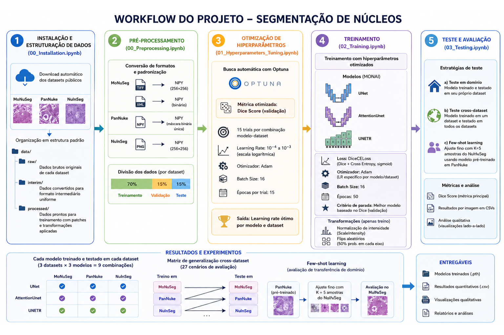
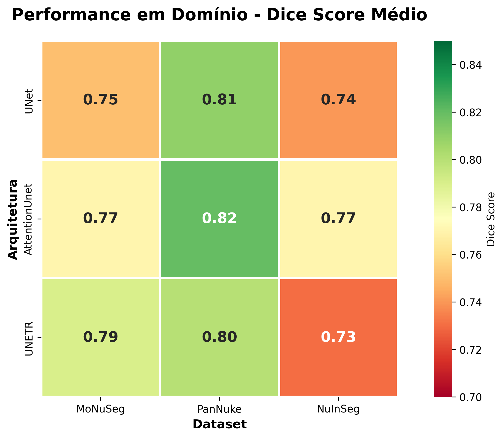
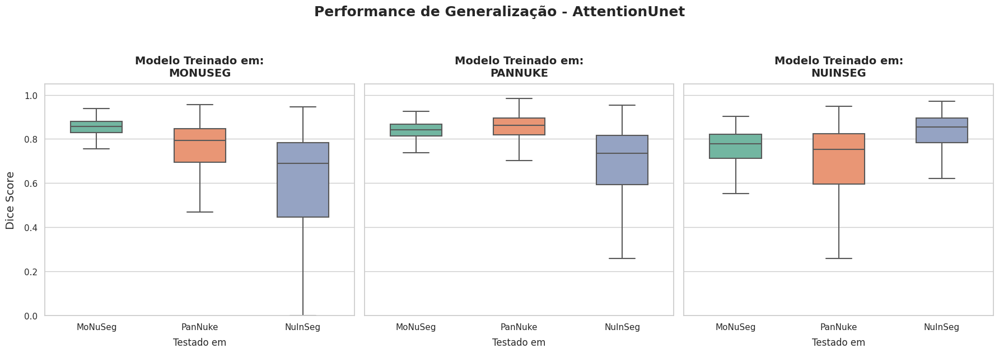
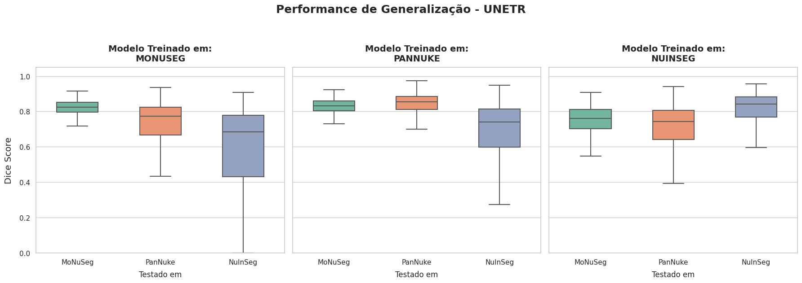
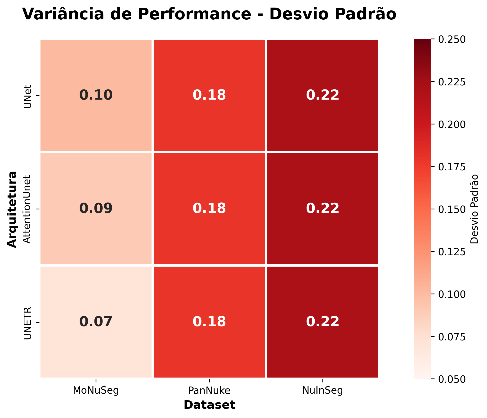
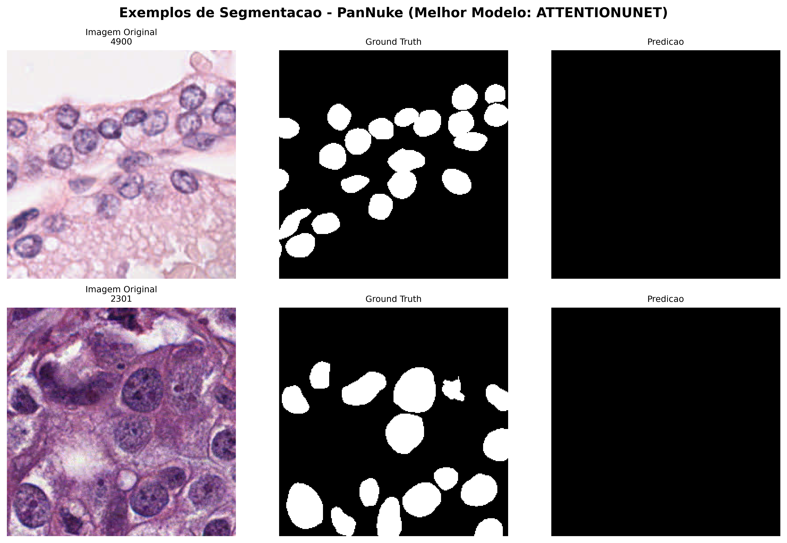
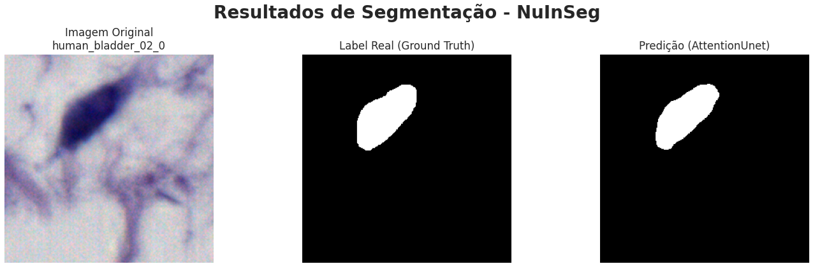
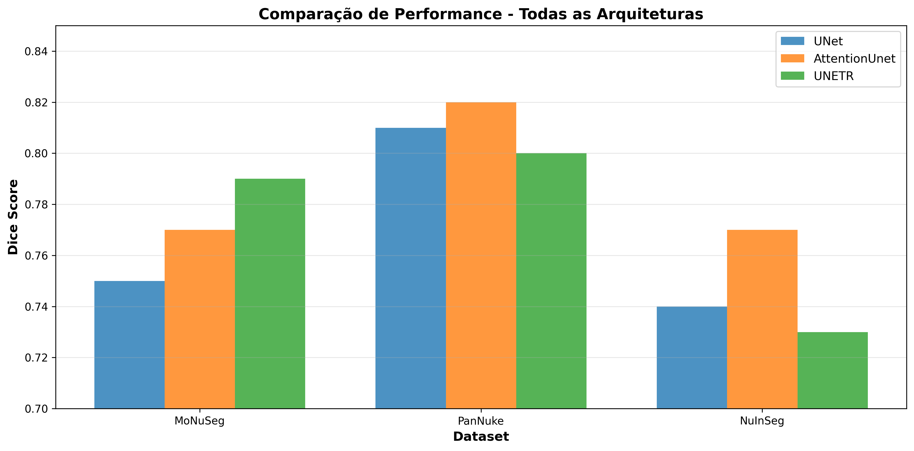

# Segmentação de núcleos em imagens histológicas com deep learning: comparação entre arquiteturas e datasets
# Nuclei segmentation in histological images using deep learning: A comparison between architectures and datasets

## Apresentação

O presente projeto foi originado no contexto das atividades da disciplina de pós-graduação *IA901 - Análise de Imagens e Reconhecimento de Padrões*, 
oferecida no primeiro semestre de 2026, na Unicamp, sob supervisão da Profa. Dra. Leticia Rittner, do Departamento de Engenharia de Computação e Automação (DCA) da Faculdade de Engenharia Elétrica e de Computação (FEEC).

|Nome  | RA | Curso|
|--|--|--|
| Alysson Matos de Souza  | 265057  | Doutorado em Engenharia Elétrica |
| Lucas Fiuza Garcia  | 300901  | Mestrado em Engenharia Elétrica |
| Vinicius Barbosa Bassete  | 248135  | Mestrado em Física Aplicada|

## Descrição do Projeto

A segmentação de núcleos celulares em imagens histológicas é uma tarefa importante em patologia digital e visão computacional aplicada à área médica. A identificação precisa dessas estruturas pode auxiliar análises quantitativas, estudos morfológicos e sistemas computacionais de apoio ao diagnóstico. Nos últimos anos, modelos baseados em deep learning passaram a apresentar resultados promissores nesse tipo de tarefa. Entretanto, imagens histológicas obtidas em laboratórios distintos podem apresentar diferenças significativas de resolução, coloração, qualidade de aquisição, tipos celulares e distribuição dos tecidos, fazendo com que modelos treinados em um determinado dataset não necessariamente apresentem o mesmo comportamento em outros cenários.

Nesse contexto, o presente projeto busca investigar o comportamento de arquiteturas de segmentação quando aplicadas a datasets histológicos com características distintas. A proposta procura se aproximar de um problema mais realista de adaptação de domínio, avaliando como diferentes modelos se comportam em situações de transferência entre bases de dados.

Para isso, são utilizados três datasets públicos amplamente adotados na literatura: MoNuSeg², PanNuke³ e NuInsSeg⁴. O projeto segue um pipeline completo de processamento de dados e treinamento, incluindo padronização de formatos, geração de patches, normalização e aumento de dados, além de divisão sistemática em conjuntos de treinamento, validação e teste. O treinamento dos modelos é precedido por uma etapa de otimização de hiperparâmetros via Optuna, com foco na maximização do Dice Score na validação.

São investigadas três arquiteturas de segmentação (UNet, Attention UNet e UNETR), treinadas sob configurações otimizadas e avaliadas de forma extensiva. A análise experimental inclui testes dentro do próprio dataset onde foi realizado o treinamento, além de avaliação cross-dataset para medir generalização entre domínios distintos e também experimentos de few-shot learning⁵ para estudar adaptação com poucas amostras. A performance dos modelos é mensurada principalmente pelo Dice Score, complementada por análises quantitativas e qualitativas das predições.

## Metodologia

O projeto segue um pipeline completo de processamento de imagem e treinamento de modelos de deep learning, estruturado em cinco etapas principais:

### 1. Instalação e Estruturação de Dados

Os datasets são obtidos automaticamente a partir de suas fontes públicas e organizados em uma estrutura padrão de reprodutibilidade:
- **raw**: dados brutos originais de cada dataset
- **interim**: dados convertidos para formato intermediário uniforme
- **processed**: dados prontos para treinamento com patches e transformações aplicadas

### 2. Pré-processamento

Responsável pela padronização e preparação dos dados de diferentes datasets:

**Conversão de formatos:**
- **MoNuSeg**: Converte imagens TIFF (1000×1000×3) em patches de 256×256 em formato NPY; máscaras em XML são convertidas para arrays NumPy binários
- **PanNuke**: Imagens já em NPY são mantidas; máscaras com 6 canais (5 tipos celulares + background) são agregadas em máscara binária única
- **NuInSeg**: Imagens e máscaras PNG (512×512) são convertidas para NPY e divididas em patches de 256×256

**Divisão dos dados:** Cada dataset é dividido em três conjuntos:
- Treinamento: 70%
- Validação: 15%
- Teste: 15%

**Transformações de dados:**
- Normalização de intensidade (ScaleIntensity)
- Flips aleatórios (50% probabilidade em cada eixo espacial) aplicados apenas ao conjunto de treinamento

### 3. Otimização de Hiperparâmetros

Utiliza a framework Optuna para busca automática dos melhores hiperparâmetros:
- **Métrica otimizada**: Dice Score na validação
- **Número de trials**: 15 por combinação modelo-dataset
- **Hiperparâmetros testados**:
  - Learning Rate: $10^{-4}$ a $10^{-3}$ (escala logarítmica)
  - Otimizador: Adam
  - Batch Size: 16
- **Épocas por trial**: 15

Os learning rates otimizados para cada arquitetura e dataset são consolidados para o treinamento final.

### 4. Treinamento

Modelos são treinados com os hiperparâmetros otimizados:

**Configuração:**
- **Modelos**: UNet, AttentionUnet e UNETR (fornecidos pelo MONAI)
- **Loss**: DiceCELoss (combinação de Dice Loss e Cross Entropy, com ativação sigmoide)
- **Otimizador**: ADAM com learning rates específicos por modelo e dataset
- **Batch Size**: 16
- **Épocas**: 50
- **Critério de parada**: Melhor modelo é salvo baseado na métrica Dice na validação

**Arquiteturas:**
- **UNet**: Canais (16, 32, 64, 128, 256), strides (2, 2, 2, 2), 2 unidades residuais por nível
- **AttentionUnet**: Mesma estrutura da UNet com mecanismos de atenção
- **UNETR**: Vision Transformer com entrada/saída adaptadas para 256×256 e segmentação binária

### 5. Teste e Avaliação

**Estratégias de teste:**

a) **Teste em domínio**: Modelo treinado em um dataset é testado em seu próprio conjunto de teste

b) **Teste cross-dataset**: Modelo treinado em um dataset é testado em todos os datasets (para avaliar generalização e efeitos de adaptação de domínio)

c) **Few-shot learning**: Ajuste fino com poucas amostras (K=5) do NuInSeg usando modelo pré-treinado em PanNuke

**Métricas de avaliação:**
- **Dice Score**: Métrica principal de segmentação (média agregada da validação)
- Resultados armazenados por imagem em CSVs para análise posterior
- **Análise qualitativa**: Visualizações lado-a-lado de imagens originais, ground truth e predições

**Experimentos:**
- Cada modelo é treinado e testado em cada dataset
- Matriz de generalização cross-dataset (3 datasets × 3 modelos = 9 combinações treino, testadas em 3 datasets = 27 cenários)
- Few-shot learning para avaliar efetividade da transferência de domínio com dados limitados

## Bases de Dados

Base de Dados | Endereço na Web | Resumo descritivo
----- | ----- | -----
PanNuke | https://warwick.ac.uk/fac/cross_fac/tia/data/pannuke/ | Grande dataset com 7904 amostras de imagens histológicas de diferentes tecidos, além de máscaras de segmentação e anotaçãoe sobre a histologia. Este dataset se destaca pela quantidade e diversidade nas amostras.
NuInsSeg | https://www.kaggle.com/datasets/ipateam/nuinsseg | Dataset com 665 amostras de imagens histológicas anotadas, desenvolvido com foco em treinar e avaliar modelos de segmentação de núcleos celulares em imagens de microscopia.
MoNuSeg | https://monuseg.grand-challenge.org/Data/ | Dataset com 44 imagens histopatológicas de diversos órgãos em alta resolução com anotações feitas manualmente por especialistas. Criado originalmente para uma competição, se tornou um benchmark frequentemente usado em pesquisas de patologia digital.

O detalhamento sobre os datasets utilizados pode ser encontrado no [datasheet desenvolvido pelo grupo](data/Datasheets.md).

## Ferramentas

O projeto foi desenvolvido em Python, utilizando bibliotecas voltadas para manipulação de dados, processamento de imagens e treinamento de modelos de deep learning. As ferramentas estão organizadas por função dentro do pipeline:

### Gerenciamento de Dados e Ambiente

- **Pathlib** e **os**: Gerenciamento de diretórios e estrutura de arquivos.
- **gdown**: Download de datasets a partir de URLs do Google Drive (utilizado para PanNuke e NuInSeg)
- **zipfile** e **shutil**: Extração e organização automatizada de arquivos dos datasets

### Processamento e Manipulação de Dados

- **NumPy**: Operações matriciais e manipulação eficiente de arrays multidimensionais para imagens e máscaras
- **Pandas**: Organização, leitura e manipulação de metadados dos datasets (CSVs com informações de treino/validação/teste)
- **xml.etree.ElementTree**: Processamento de anotações em formato XML presentes no dataset MoNuSeg (parsing de contornos de núcleos)

### Processamento de Imagens

- **PIL (Pillow)**: Leitura e carregamento de imagens nos formatos PNG e TIFF
- **scikit-image**: Manipulação avançada de imagens (conversão de anotações XML para máscaras binárias, operações morfológicas)

### Visualização

- **Matplotlib**: Visualização de imagens, máscaras de segmentação e resultados de predições
- **Seaborn**: Visualizações estatísticas de resultados (boxplots, distribuições de Dice Score)

### Deep Learning e Redes Neurais

- **PyTorch**: Framework principal para desenvolvimento e treinamento das redes neurais
  - Gestão de tensores e computação em GPU/CPU
  - Otimizadores (Adam, AdamW)
  - Utilitários de training loop e inferência

- **MONAI (Medical Open Network for AI)**: Framework especializado em deep learning para imagens médicas
  - Implementação das arquiteturas: UNet, AttentionUnet e UNETR
  - DataLoaders e transformações específicas para dados médicos (LoadImaged, EnsureChannelFirstd, ScaleIntensityd, RandFlipd)
  - Métricas de segmentação: DiceMetric
  - Loss functions: DiceCELoss (combinação de Dice Loss e Cross Entropy)

### Otimização e Ajuste de Hiperparâmetros

- **Optuna**: Framework de otimização bayesiana para busca automática de hiperparâmetros
  - Busca em espaço contínuo para Learning Rate
  - Amostragem categórica para Otimizador e Batch Size
  - Pruning de trials não promissores para economia computacional

## Workflow

O workflow atual do projeto segue a estrutura ilustrada abaixo:

## Experimentos, Resultados e Discussão

### Desempenho em Domínio

Os modelos foram treinados e testados no mesmo dataset, refletindo a capacidade de cada arquitetura em se adaptar a características específicas de cada domínio. A tabela abaixo apresenta os Dice Scores médios obtidos no conjunto de teste de cada dataset:

A figura acima visualiza a performance média de cada modelo por dataset através de um heatmap, facilitando a comparação entre arquiteturas.

**Observações:**

- **MoNuSeg**: Todos os modelos apresentaram desempenho relativamente consistente, com UNETR ligeiramente superior ($0.79 \pm 0.07$). O menor desvio padrão observado em UNETR sugere maior estabilidade na segmentação de núcleos em diferentes regiões de interesse.

- **PanNuke**: Alcançou os maiores Dice Scores em média, com AttentionUnet ligeiramente superior ($0.82 \pm 0.18$). Porém, o desvio padrão elevado ($0.18$) indica maior variabilidade entre amostras, refletindo a diversidade de tecidos e tipos celulares presentes no dataset.

- **NuInSeg**: Apresentou os menores desempenhos e maior variabilidade ($0.22$). UNETR obteve o menor Dice neste dataset ($0.73 \pm 0.22$), enquanto AttentionUnet mostrou-se mais robusto ($0.77 \pm 0.22$).

### Generalização Cross-Dataset

A generalização entre datasets foi avaliada através de um protocolo de teste cruzado, em que modelos treinados em um dataset foram testados em todos os outros datasets. Foram realizados 27 cenários de teste (9 modelos × 3 datasets).

**Principais achados:**

1. **Degradação de Desempenho em Mudança de Domínio**: Observou-se uma queda significativa no desempenho ao testar modelos em datasets diferentes do utilizado no treinamento. Isso confirma que as características visuais, histológicas e de aquisição de cada dataset impõem desafios na generalização de modelos.

2. **Melhor Transferência**: Modelos treinados em PanNuke apresentaram melhor capacidade de generalização para outros datasets, provavelmente devido à sua maior diversidade de tipos celulares e tecidos (~7900 amostras).

3. **Variabilidade por Arquitetura**: Embora UNETR tenha apresentado desempenho ligeiramente melhor em alguns cenários de teste em domínio, sua transferibilidade mostrou-se menos estável que a de modelos baseados em U-Net quando extrapolados para novos domínios.

### Otimização de Hiperparâmetros

A otimização com Optuna (15 trials por combinação modelo-dataset) revelou learning rates ótimos específicos para cada arquitetura e dataset:

- **UNET**: Learning rates variaram entre $2.44 \times 10^{-4}$ (PanNuke) e $8.61 \times 10^{-4}$ (MoNuSeg)
- **AttentionUnet**: Learning rates entre $4.65 \times 10^{-4}$ (PanNuke) e $7.44 \times 10^{-4}$ (NuInSeg)
- **UNETR**: Learning rates entre $1.19 \times 10^{-4}$ (NuInSeg) e $2.44 \times 10^{-4}$ (MoNuSeg)

Estes valores reforçam que diferentes arquiteturas e datasets requerem configurações de otimizador adaptadas para máxima eficiência.

### Few-Shot Learning

Modelos pré-treinados em PanNuke foram submetidos a fine-tuning com apenas K=5 amostras de MoNuSeg. Este experimento simula cenários práticos onde dados anotados do domínio alvo são escassos.

**Resultados:** O fine-tuning com poucas amostras demonstrou a viabilidade de adaptação rápida de modelos, reduzindo a necessidade de anotações extensivas do novo domínio. Porém, a qualidade das segmentações permaneceu inferior às do modelo treinado exclusivamente em domínio.

### Distribuição de Variância

A análise da distribuição de Dice Scores entre amostras revelou:

- **Menor variância**: MoNuSeg apresenta patches mais homogêneos em qualidade de segmentação (desvio padrão ~0.09-0.10)
- **Maior variância**: NuInSeg apresenta heterogeneidade significativa nas dificuldades de segmentação por amostra (desvio padrão ~0.22)
- **Intermediária**: PanNuke com variância moderada a alta (~0.18), refletindo sua diversidade de tecidos

### Observações

1. **Não há arquitetura universal**: A melhor arquitetura varia por dataset. UNETR foi superior em MoNuSeg, AttentionUnet em PanNuke, e novamente AttentionUnet em NuInSeg.

2. **Transferência de domínio é desafiadora**: A queda de desempenho ao testar cross-dataset confirma que a variabilidade de aquisição e histologia entre bases de dados é substancial.

3. **PanNuke como base**: Sua maior diversidade o torna uma excelente fonte para pré-treinamento, com melhor transferência para outros datasets.

4. **Few-shot promissor**: A capacidade de adaptação com poucas amostras abre caminho para aplicações práticas com dados limitados.

### Exemplos Visuais de Segmentação

As figuras abaixo apresentam exemplos visuais do desempenho de segmentação para cada dataset, mostrando a imagem original, a anotação manual (ground truth) e a predição do melhor modelo para o dataset:

#### PanNuke - Exemplos de Segmentação

Os exemplos de PanNuke mostram a capacidade do AttentionUnet em segmentar núcleos em imagens com diversidade de tipos celulares e tecidos, obtendo Dice Score médio de 0.82.

#### NuInSeg - Exemplos de Segmentação

Os exemplos de NuInSeg demonstram os desafios encontrados neste dataset, onde o AttentionUnet obteve desempenho de 0.77, refletindo a complexidade e variabilidade das imagens.

### Comparação de Arquiteturas

O gráfico acima apresenta uma comparação agregada do desempenho de cada arquitetura em todos os datasets, facilitando a identificação de padrões de desempenho.

## Conclusão

### Principais Conclusões

O presente projeto demonstrou que a segmentação de núcleos em imagens histológicas apresenta desafios substanciais quando abordada sob a perspectiva de adaptação de domínio. As principais conclusões obtidas são:

1. **Inexistência de Arquitetura Universal**: Diferentes arquiteturas de deep learning apresentam desempenho variável conforme o dataset. Não existe uma solução única que seja ótima para todos os cenários — UNETR foi superior em MoNuSeg, enquanto AttentionUnet dominou em PanNuke e NuInSeg. Isso indica que as características específicas de cada dataset (resolução, coloração, tipos celulares) exigem ajustes arquiteturais.

2. **Transferabilidade Limitada Entre Datasets**: A queda significativa de performance ao testar modelos em datasets diferentes do treinamento confirma a magnitude do desafio de adaptação de domínio. Modelos treinados em um dataset apresentam degradação substancial quando aplicados a novos domínios, refletindo diferenças fundamentais entre as bases de dados.

3. **PanNuke como Melhor Base para Pré-treinamento**: Devido à sua maior diversidade (~7900 amostras) e variedade de tecidos e tipos celulares, PanNuke se destacou como excelente fonte para pré-treinamento, apresentando melhor capacidade de generalização para outros datasets em comparação com MoNuSeg e NuInSeg.

4. **Variabilidade Intrínseca dos Dados**: Cada dataset apresenta nível diferente de variância nas dificuldades de segmentação. MoNuSeg é mais homogêneo (desvio ~0.09-0.10), NuInSeg altamente heterogêneo (desvio ~0.22), e PanNuke intermediário (~0.18), refletindo diferenças na qualidade de anotação e características visuais.

5. **Few-Shot Learning Viável mas Limitado**: A capacidade de adaptação com apenas K=5 amostras demonstra a viabilidade de ajuste rápido de modelos pré-treinados. Porém, a qualidade das segmentações permanece inferior à de modelos treinados exclusivamente em domínio, indicando que quantidade limitada de dados do domínio-alvo é insuficiente para adaptação completa.

### Principais Desafios Enfrentados

- **Heterogeneidade de Formatos**: Datasets originários de diferentes fontes apresentavam formatos, dimensões e anotações heterogêneas (XML para MoNuSeg, NPY para PanNuke, PNG para NuInSeg), exigindo pipeline de pré-processamento robusto e flexível.

- **Desbalanceamento Computacional**: A otimização de hiperparâmetros com Optuna, treinamento de múltiplas arquiteturas e testes cross-dataset em 27 cenários demandou recursos computacionais significativos, limitando a exploração mais extensiva de estratégias de adaptação.

- **Métricas Insuficientes**: O Dice Score, embora amplamente utilizado, não captura todos os aspectos de qualidade de segmentação. Análise qualitativa adicional seria necessária para compreender tipos específicos de erros.

- **Estabilidade de UNETR**: Apesar de desempenho competitivo em domínio, UNETR apresentou comportamento menos previsível na transferência cross-dataset, sugerindo que arquiteturas baseadas em Transformers podem requerer estratégias específicas de regularização ou fine-tuning.

### Lições Aprendidas

1. **Pipeline Modular é Essencial**: Estruturação clara do pipeline (pré-processamento → otimização → treinamento → teste) facilitou experimentação sistemática e reprodutibilidade.

2. **Validação Cruzada Necessária**: A análise cross-dataset revelou informações que não seriam capturados por avaliação em domínio único, destacando a importância de protocolos de teste mais rigorosos em pesquisa de visão computacional médica.

3. **Trade-off Entre Complexidade e Generalização**: Modelos mais simples (UNet) frequentemente apresentaram transferência comparável ou superior a modelos mais complexos (UNETR), sugerindo que simplicidade arquitetural pode favorecer generalização.

## Trabalhos Futuros

Para trabalhos futuros, uma melhoria seria a inclusão de métricas de avaliação focadas nos contornos das segmentações, como a Distância de Hausdorff Média e a Distância de Superfície Simétrica. Atualmente, a avaliação do projeto apoia-se fortemente no Coeficiente de Dice, que é excelente para medir a sobreposição de área. Contudo, quantificar o erro exato dos contornos forneceria uma análise mais robusta sobre a capacidade geométrica dos modelos ao operarem em imagens não vistas.

Além disso, embora o projeto tenha utilizado uma estratégia de transferência e fine-tuning com suporte reduzido (Few-Shot do tipo TransFT), a exploração de metodologias avançadas de Few-Shot Learning⁵, como no artigo referenciado e que foi descoberto durante a revisão do estado-da-arte, representaria um avanço significativo.

## Uso de IA Generativa
- Implementação de script para geração de samples: O Claude foi utilizado para gerar um script base de geração da pasta '*\data\samples'. Foram feitas diversas adaptações em cima desse script base, para que essa geração se adequasse ao projeto.
    - Prompt Utilizado: "baseado no notebook (00_installation.ipynb), implemente um script que gere samples para os dados dos datasets"

- Interpretação inicial dos artigos referenciados no projeto: O NotebookLM foi utilizado para auxílio na síntese de informações presentes nos artigos sobre os datasets e sobre estruturação de datasheets para datasets.
    - Prompt Utilizado: "com base na estrutura de um datasheet sugerida pelo artigo Datasheets for Datasets, busque nos artigos dos datasets as informações necessárias para o preenchimento das seções"

- Melhoria de escrita: O Claude foi utilizado em algumas ocasiões para melhorar algumas partes do texto.
    - Prompts Utilizados: variações de "melhore essa frase/parte do texto"

- Criação do Workflow: O ChatGPT foi utilizado para gerar a imagem do workflow a partir da descrição da metodologia.
    - Prompt Utilizado: "gere uma imagem para o workflow sobre a seguinte metodologia do projeto"

## Referências

¹ GEBRU, Timnit et al. *Datasheets for Datasets*. arXiv preprint arXiv:1803.09010, 2021.

² KUMAR, Neeraj et al. *A Multi-Organ Nucleus Segmentation Challenge*. IEEE Transactions on Medical Imaging, v. 39, n. 5, p. 1380–1391, 2020.

³ LJUBENOVIĆ, M. et al. *NuInsSeg: A Fully Annotated Dataset for Nuclei Instance Segmentation in H&E-Stained Histological Images*. arXiv preprint arXiv:2207.04643, 2022.

⁴ GAMPER, Jevgenij et al. *PanNuke: An Open Pan-Cancer Histology Dataset for Nuclei Instance Segmentation and Classification*. In: European Congress on Digital Pathology. Springer, 2019. p. 11–19.

⁵ MING, Yu et al. *Few-Shot Learning for Annotation-Efficient Nucleus Instance Segmentation.* IEEE Transactions on Medical Imaging, v. 44, n. 8, 2025