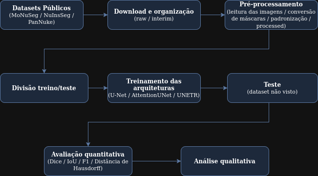

# Segmentação de núcleos em imagens histológicas com deep learning: comparação entre arquiteturas e datasets
# Nuclei segmentation in histological images using deep learning: A comparison between architectures and datasets

## Apresentação

O presente projeto foi originado no contexto das atividades da disciplina de pós-graduação *IA901 - Análise de Imagens e Reconhecimento de Padrões*, 
oferecida no primeiro semestre de 2026, na Unicamp, sob supervisão da Profa. Dra. Leticia Rittner, do Departamento de Engenharia de Computação e Automação (DCA) da Faculdade de Engenharia Elétrica e de Computação (FEEC).

|Nome  | RA | Curso|
|--|--|--|
| Alysson Matos de Souza  | 265057  | Doutorado em Engenharia Elétrica |
| Lucas Fiuza Garcia  | 300901  | Mestrado em Engenharia Elétrica |
| Vinicius Barbosa Bassete  | 248135  | Mestrado em Física Aplicada|

## Descrição do Projeto

A segmentação de núcleos celulares em imagens histológicas é uma tarefa importante em patologia digital e visão computacional aplicada à área médica. A identificação precisa dessas estruturas pode auxiliar análises quantitativas, estudos morfológicos e sistemas computacionais de apoio ao diagnóstico. Nos últimos anos, modelos baseados em deep learning passaram a apresentar resultados promissores nesse tipo de tarefa. Entretanto, imagens histológicas obtidas em laboratórios distintos podem apresentar diferenças significativas de resolução, coloração, qualidade de aquisição, tipos celulares e distribuição dos tecidos, fazendo com que modelos treinados em um determinado dataset não necessariamente apresentem o mesmo comportamento em outros cenários.

Nesse contexto, o presente projeto busca investigar o comportamento de arquiteturas de segmentação quando aplicadas a datasets histológicos com características distintas. A proposta procura se aproximar de um problema mais realista de adaptação de domínio, avaliando como diferentes modelos se comportam em situações de transferência entre bases de dados.

Para isso, serão utilizados três datasets públicos amplamente utilizados na literatura: MoNuSeg, PanNuke e NuInsSeg. Inicialmente, pretende-se realizar experimentos de treinamento e teste entre diferentes bases, analisando qualitativamente e quantitativamente os resultados obtidos. Posteriormente, também serão exploradas estratégias relacionadas a fine-tuning e adaptação de domínio.

## Metodologia

O projeto segue um pipeline completo de processamento de imagem e treinamento de modelos de deep learning, estruturado em cinco etapas principais:

### 1. Instalação e Estruturação de Dados

Os datasets são obtidos automaticamente a partir de suas fontes públicas e organizados em uma estrutura padrão de reprodutibilidade:
- **raw**: dados brutos originais de cada dataset
- **interim**: dados convertidos para formato intermediário uniforme
- **processed**: dados prontos para treinamento com patches e transformações aplicadas

### 2. Pré-processamento

Responsável pela padronização e preparação dos dados de diferentes datasets:

**Conversão de formatos:**
- **MoNuSeg**: Converte imagens TIFF (1000×1000×3) em patches de 256×256 em formato NPY; máscaras em XML são convertidas para arrays NumPy binários
- **PanNuke**: Imagens já em NPY são mantidas; máscaras com 6 canais (5 tipos celulares + background) são agregadas em máscara binária única
- **NuInSeg**: Imagens e máscaras PNG (512×512) são convertidas para NPY e divididas em patches de 256×256

**Divisão dos dados:** Cada dataset é dividido em três conjuntos:
- Treinamento: 70%
- Validação: 15%
- Teste: 15%

**Transformações de dados:**
- Normalização de intensidade (ScaleIntensity)
- Flips aleatórios (50% probabilidade em cada eixo espacial) aplicados apenas ao conjunto de treinamento

### 3. Otimização de Hiperparâmetros

Utiliza a framework Optuna para busca automática dos melhores hiperparâmetros:
- **Métrica otimizada**: Dice Score na validação
- **Número de trials**: 15 por combinação modelo-dataset
- **Hiperparâmetros testados**:
  - Learning Rate: $10^{-4}$ a $10^{-3}$ (escala logarítmica)
  - Otimizador: Adam
  - Batch Size: 16
- **Épocas por trial**: 15

Os learning rates otimizados para cada arquitetura e dataset são consolidados para o treinamento final.

### 4. Treinamento

Modelos são treinados com os hiperparâmetros otimizados:

**Configuração:**
- **Modelos**: UNet, AttentionUnet e UNETR (fornecidos pelo MONAI)
- **Loss**: DiceCELoss (combinação de Dice Loss e Cross Entropy, com sigmoid ativação)
- **Otimizador**: Adam com learning rates específicos por modelo e dataset
- **Batch Size**: 16
- **Épocas**: 50
- **Critério de parada**: Melhor modelo é salvo baseado na métrica Dice na validação

**Arquiteturas:**
- **UNet**: Canais (16, 32, 64, 128, 256), strides (2, 2, 2, 2), 2 unidades residuais por nível
- **AttentionUnet**: Mesma estrutura da UNet com mecanismos de atenção
- **UNETR**: Vision Transformer com entrada/saída adaptadas para 256×256 e segmentação binária

### 5. Teste e Avaliação

**Estratégias de teste:**

a) **Teste em domínio**: Modelo treinado em um dataset é testado em seu próprio conjunto de teste

b) **Teste cross-dataset**: Modelo treinado em um dataset é testado em todos os datasets (para avaliar generalização e efeitos de adaptação de domínio)

c) **Few-shot learning**: Ajuste fino com poucas amostras (K=5) do MoNuSeg usando modelo pré-treinado em PanNuke

**Métricas de avaliação:**
- **Dice Score**: Métrica principal de segmentação (média agregada da validação)
- Resultados armazenados por imagem em CSVs para análise posterior
- **Análise qualitativa**: Visualizações lado-a-lado de imagens originais, ground truth e predições

**Experimentos:**
- Cada modelo é treinado e testado em cada dataset
- Matriz de generalização cross-dataset (3 datasets × 3 modelos = 9 combinações treino, testadas em 3 datasets = 27 cenários)
- Few-shot learning para avaliar efetividade da transferência de domínio com dados limitados

## Bases de Dados

Base de Dados | Endereço na Web | Resumo descritivo
----- | ----- | -----
PanNuke | https://warwick.ac.uk/fac/cross_fac/tia/data/pannuke/ | Grande dataset com 7904 amostras de imagens histológicas de diferentes tecidos, além de máscaras de segmentação e anotaçãoe sobre a histologia. Este dataset se destaca pela quantidade e diversidade nas amostras.
NuInsSeg | https://www.kaggle.com/datasets/ipateam/nuinsseg | Dataset com 665 amostras de imagens histológicas anotadas, desenvolvido com foco em treinar e avaliar modelos de segmentação de núcleos celulares em imagens de microscopia.
MoNuSeg | https://monuseg.grand-challenge.org/Data/ | Dataset com 44 imagens histopatológicas de diversos órgãos em alta resolução com anotações feitas manualmente por especialistas. Criado originalmente para uma competição, se tornou um benchmark frequentemente usado em pesquisas de patologia digital.

O detalhamento sobre os datasets utilizados pode ser encontrado no [datasheet desenvolvido pelo grupo](data/Datasheets.md).

## Ferramentas

O projeto está sendo desenvolvido em Python, utilizando bibliotecas voltadas para manipulação de dados, processamento de imagens e treinamento de modelos de deep learning. As ferramentas estão organizadas por função dentro do pipeline:

### Gerenciamento de Dados e Ambiente

- **Pathlib** e **os**: Gerenciamento de diretórios e estrutura de arquivos.
- **gdown**: Download de datasets a partir de URLs do Google Drive (utilizado para PanNuke e NuInSeg)
- **zipfile** e **shutil**: Extração e organização automatizada de arquivos dos datasets

### Processamento e Manipulação de Dados

- **NumPy**: Operações matriciais e manipulação eficiente de arrays multidimensionais para imagens e máscaras
- **Pandas**: Organização, leitura e manipulação de metadados dos datasets (CSVs com informações de treino/validação/teste)
- **xml.etree.ElementTree**: Processamento de anotações em formato XML presentes no dataset MoNuSeg (parsing de contornos de núcleos)

### Processamento de Imagens

- **PIL (Pillow)**: Leitura e carregamento de imagens nos formatos PNG e TIFF
- **scikit-image**: Manipulação avançada de imagens (conversão de anotações XML para máscaras binárias, operações morfológicas)

### Visualização

- **Matplotlib**: Visualização de imagens, máscaras de segmentação e resultados de predições
- **Seaborn**: Visualizações estatísticas de resultados (boxplots, distribuições de Dice Score)

### Deep Learning e Redes Neurais

- **PyTorch**: Framework principal para desenvolvimento e treinamento das redes neurais
  - Gestão de tensores e computação em GPU/CPU
  - Otimizadores (Adam, AdamW)
  - Utilitários de training loop e inferência

- **MONAI (Medical Open Network for AI)**: Framework especializado em deep learning para imagens médicas
  - Implementação das arquiteturas: UNet, AttentionUnet e UNETR
  - DataLoaders e transformações específicas para dados médicos (LoadImaged, EnsureChannelFirstd, ScaleIntensityd, RandFlipd)
  - Métricas de segmentação: DiceMetric
  - Loss functions: DiceCELoss (combinação de Dice Loss e Cross Entropy)

### Otimização e Ajuste de Hiperparâmetros

- **Optuna**: Framework de otimização bayesiana para busca automática de hiperparâmetros
  - Busca em espaço contínuo para Learning Rate
  - Amostragem categórica para Otimizador e Batch Size
  - Pruning de trials não promissores para economia computacional

## Workflow

O workflow atual do projeto segue a estrutura ilustrada abaixo:

## Experimentos e Resultados preliminares

Para cada dataset, realizou-se o treinamento de três tipos de redes neurais: UNET, AttentionUnet e UNETR, disponíveis no pacote Python MONAI. Os conjunto de treino, validação e teste foram divididos seguindo uma proporção de 70%, 15% e 15%, respectivamente. 

#### Transformações aplicadas as imagens e máscaras
De forma geral, aplicou-se transformações de Normalização de intensidade e rotações aleatórias nas imagens do conjunto de treino.

#### Treinamento
Aplicou-se os mesmos hiperparâmetros para todos os tipos de redes utilizados, independente do dataset escolhido:
- Otimizador: ADAM
- Learning Rate: $10^{-4}$
- Batch Size: 16
- Número de épocas: 50

#### Resultados
Com as redes treinadas em cada dataset, obteve-se, nos respectivos conjuntos de teste, os seguintes DICES médios:

| Dataset | UNET | AttentionUnet | UNETR |
| --- | --- | --- | --- |
| **MoNuSeg** | $0.75 \pm 0.10$ | $0.77 \pm 0.09$ | $0.79 \pm 0.07$ |
| **PanNuke** | $0.81 \pm 0.18$ | $0.82 \pm 0.18$ | $0.80 \pm 0.18$ |
| **NuInSeg** | $0.74 \pm 0.22$ | $0.77 \pm 0.22$ | $0.73 \pm 0.22$ |

## Uso de IA Generativa
- Implementação de script para geração de samples: O Claude foi utilizado para gerar um script base de geração da pasta '*\data\samples'. Foram feitas diversas adaptações em cima desse script base, para que essa geração se adequasse ao projeto.
    - Prompt Utilizado: "baseado no notebook (00_installation.ipynb), implemente um script que gere samples para os dados dos datasets"

- Interpretação inicial dos artigos referenciados no projeto: O NotebookLM foi utilizado para auxílio na síntese de informações presentes nos artigos sobre os datasets e sobre estruturação de datasheets para datasets.
    - Prompt Utilizado: "com base na estrutura de um datasheet sugerida pelo artigo Datasheets for Datasets, busque nos artigos dos datasets as informações necessárias para o preenchimento das seções"

- Melhoria de escrita: O Claude foi utilizado em algumas ocasiões para melhorar algumas partes do texto.
    - Prompts Utilizados: variações de "melhore essa frase/parte do texto"

## Referências

¹ GEBRU, Timnit et al. *Datasheets for Datasets*. arXiv preprint arXiv:1803.09010, 2021.

² KUMAR, Neeraj et al. *A Multi-Organ Nucleus Segmentation Challenge*. IEEE Transactions on Medical Imaging, v. 39, n. 5, p. 1380–1391, 2020.

³ LJUBENOVIĆ, M. et al. *NuInsSeg: A Fully Annotated Dataset for Nuclei Instance Segmentation in H&E-Stained Histological Images*. arXiv preprint arXiv:2207.04643, 2022.

⁴ GAMPER, Jevgenij et al. *PanNuke: An Open Pan-Cancer Histology Dataset for Nuclei Instance Segmentation and Classification*. In: European Congress on Digital Pathology. Springer, 2019. p. 11–19.